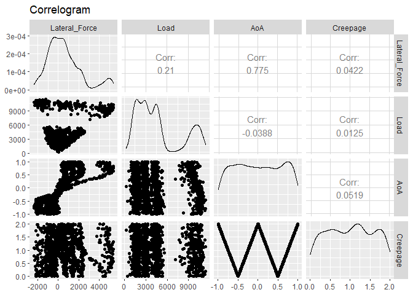
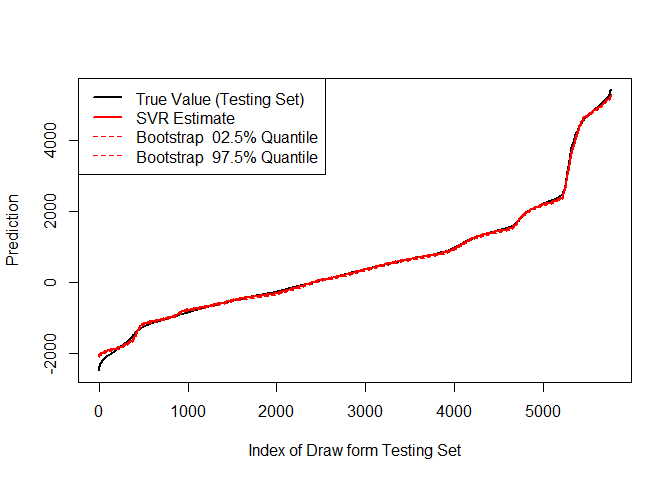
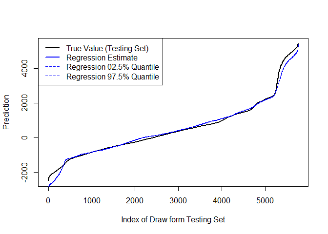
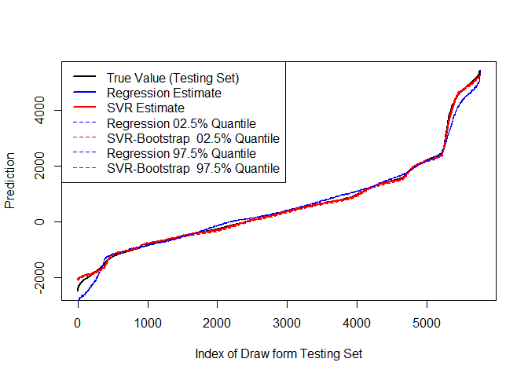
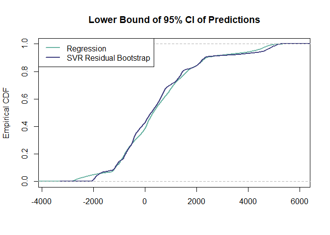
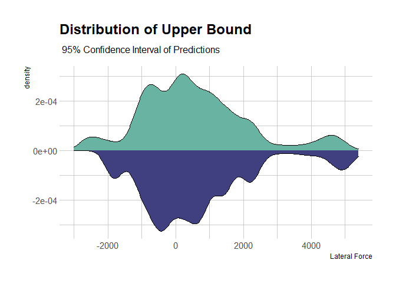
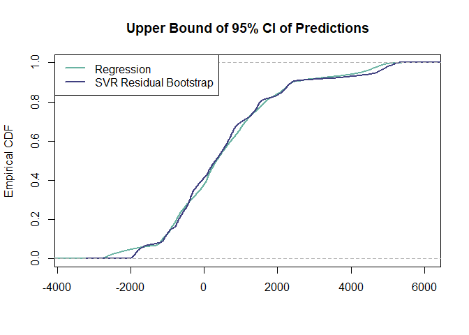

SVR Model for Lateral Force & Empirical Distribution of Predictions
================
Mohammad Hosseini (<mohammadhosseini@vt.edu>)

-----

### Data Set Preparation

``` r
## Load data
load("FinalDataset.rda")
summary(data)
```

    ##  Longitudinal_Force Lateral_Force          Load              AoA      
    ##  Min.   :-798.9     Min.   :-2644.1   Min.   : -155.3   Min.   :-1.0  
    ##  1st Qu.: 475.6     1st Qu.: -566.9   1st Qu.: 2191.5   1st Qu.:-0.5  
    ##  Median : 997.6     Median :  280.8   Median : 3693.5   Median : 0.0  
    ##  Mean   :1428.7     Mean   :  552.2   Mean   : 4752.4   Mean   : 0.0  
    ##  3rd Qu.:1907.3     3rd Qu.: 1329.6   3rd Qu.: 6220.4   3rd Qu.: 0.5  
    ##  Max.   :5877.6     Max.   : 5582.7   Max.   :12430.1   Max.   : 1.0  
    ##     Creepage  
    ##  Min.   :0.0  
    ##  1st Qu.:0.5  
    ##  Median :1.0  
    ##  Mean   :1.0  
    ##  3rd Qu.:1.5  
    ##  Max.   :2.0

``` r
## Divide into training and testing sets
set.seed(98)
n <- nrow(data)
size <- floor(n*0.7)
train.ind <- sample(n, size, replace=FALSE)
train <- data[ train.ind,]
test  <- data[-train.ind,]

## Decrease the sampling rate
ind.100  <- seq(from = 1, to = nrow(train), by = 100)
ind.1000 <- seq(from = 1, to = nrow(train), by = 1000)
train_100  <- train[ind.100,]
train_1000 <- train[ind.1000,]
save(train_100,  file = "train_100.rda")
save(train_1000, file = "train_1000.rda")

ind.100  <- seq(from = 1, to = nrow(test), by = 100)
ind.1000 <- seq(from = 1, to = nrow(test), by = 1000)
test_100  <- test[ind.100,]
test_1000 <- test[ind.1000,]
```

``` r
library(ggplot2)
library(GGally)
ggpairs(train_1000[,-1], title="Correlogram")
```

<!-- -->

<br>

### Mutliple Regression Model

``` r
## Fit model
multiple.reg <- lm(Lateral_Force ~ AoA + Load + AoA*Load + AoA*Creepage, data = train_100[, -1])
summary(multiple.reg)
```

    ## 
    ## Call:
    ## lm(formula = Lateral_Force ~ AoA + Load + AoA * Load + AoA * 
    ##     Creepage, data = train_100[, -1])
    ## 
    ## Residuals:
    ##      Min       1Q   Median       3Q      Max 
    ## -1791.25  -202.46    -8.82   186.10  2017.90 
    ## 
    ## Coefficients:
    ##                Estimate Std. Error  t value Pr(>|t|)    
    ## (Intercept)  -3.271e+01  7.704e+00   -4.245 2.20e-05 ***
    ## AoA           1.209e+03  1.424e+01   84.913  < 2e-16 ***
    ## Load          1.417e-01  9.731e-04  145.632  < 2e-16 ***
    ## Creepage     -4.193e+01  5.406e+00   -7.757 9.36e-15 ***
    ## AoA:Load      4.607e-01  1.702e-03  270.592  < 2e-16 ***
    ## AoA:Creepage -9.806e+02  9.341e+00 -104.979  < 2e-16 ***
    ## ---
    ## Signif. codes:  0 '***' 0.001 '**' 0.01 '*' 0.05 '.' 0.1 ' ' 1
    ## 
    ## Residual standard error: 363.2 on 13434 degrees of freedom
    ## Multiple R-squared:  0.952,  Adjusted R-squared:  0.952 
    ## F-statistic: 5.334e+04 on 5 and 13434 DF,  p-value: < 2.2e-16

``` r
confint(multiple.reg, level = 0.95)
```

    ##                     2.5 %       97.5 %
    ## (Intercept)   -47.8074354  -17.6047215
    ## AoA          1180.8843581 1236.6920544
    ## Load            0.1398107    0.1436256
    ## Creepage      -52.5243672  -31.3328596
    ## AoA:Load        0.4573210    0.4639949
    ## AoA:Creepage -998.9558976 -962.3351064

``` r
## Make predictions
multiple.reg.pred <- predict(multiple.reg, newdata=test_100, interval="confidence")

## Performance
library(MLmetrics, quietly = TRUE)
performance <- data.frame(
               R2.train = R2_Score(fitted(multiple.reg), train_100$Lateral_Force),
               RMSE = RMSE(multiple.reg.pred, test_100$Lateral_Force))
print(performance)
```

    ##    R2.train     RMSE
    ## 1 0.9520442 358.0273

<br>

### Support Vector Regression, Multiple Model

``` r
## Load libraries
library(e1071,     quietly = TRUE)
library(MLmetrics, quietly = TRUE)
library(tidyverse, quietly = TRUE)

## Fit model
model <- svm(Lateral_Force ~ AoA + Load + Creepage, data = train_100, 
             kernel = "radial", gamma = 16)
summary(model)
```

    ## 
    ## Call:
    ## svm(formula = Lateral_Force ~ AoA + Load + Creepage, data = train_100, 
    ##     kernel = "radial", gamma = 16)
    ## 
    ## 
    ## Parameters:
    ##    SVM-Type:  eps-regression 
    ##  SVM-Kernel:  radial 
    ##        cost:  1 
    ##       gamma:  16 
    ##     epsilon:  0.1 
    ## 
    ## 
    ## Number of Support Vectors:  3660

``` r
## Make predictions
predictions <- model %>% predict(test_100, interval = "confidence")

## Performance
performance <- data.frame(
               R2.train = R2_Score(fitted(model), train_100$Lateral_Force),
               RMSE = RMSE(predictions, test_100$Lateral_Force))
print(performance)
```

    ##    R2.train     RMSE
    ## 1 0.9905024 176.0183

<br>

### Residual Bootstrap for SVR Model

``` r
## Residaul bootstrap function
res.bootstrap <- function(B, residuals, mu.hat){
  y.boot <- matrix(NA, ncol=B, nrow=length(residuals))
  # Resample residuals
  for (i in 1:B){
    ind <- sample(1:length(residuals), size=length(residuals), replace=TRUE)
    residual.boot <- residuals[ind]
    y.boot[, i] <- mu.hat + residual.boot
  }
  return(y.boot)
}
```

``` r
## Calculate residuals 
mu.hat <- predictions
residuals <- test_100$Lateral_Force - mu.hat

## Run bootstrap for 100 times
B <- 100
boot.pred <- res.bootstrap(B, residuals, mu.hat)

## 95% confidence interval of predictions
boot.pred.sd    <- apply(boot.pred, 1, sd)
boot.pred.q02.5 <- as.numeric(mu.hat) + qnorm(0.025)*(boot.pred.sd/sqrt(B))
boot.pred.q97.5 <- as.numeric(mu.hat) + qnorm(0.975)*(boot.pred.sd/sqrt(B))
boot.pred.summary <- round(rbind(multiple.reg.pred[,1], mu.hat,
                                 multiple.reg.pred[,2], boot.pred.q02.5, 
                                 multiple.reg.pred[,3], boot.pred.q97.5))
rownames(boot.pred.summary) <- c("Regression Estimate",       "SVR Estimate",
                                 "Regression 02.5% Quantile", "Bootstrap  02.5% Quantile",
                                 "Regression 97.5% Quantile", "Bootstrap  97.5% Quantile")
colnames(boot.pred.summary) <- NULL
boot.pred.summary[, 1:10]
```

    ##                           [,1] [,2] [,3] [,4] [,5] [,6] [,7] [,8] [,9] [,10]
    ## Regression Estimate        103  199   84  163   14  208  134   51   96  -127
    ## SVR Estimate              -334 -372 -352 -384 -376 -363 -381 -373 -369  -602
    ## Regression 02.5% Quantile   78  173   59  137  -11  182  108   26   71  -151
    ## Bootstrap  02.5% Quantile -379 -407 -391 -413 -413 -395 -415 -408 -411  -632
    ## Regression 97.5% Quantile  129  225  110  189   39  233  159   75  121  -103
    ## Bootstrap  97.5% Quantile -290 -337 -312 -355 -340 -332 -347 -338 -327  -572

``` r
## Plot results
plot(1:length(test_100[,2]), sort(test_100[,2]), type="line", lwd=2,
     ylab="Prediction", xlab="Index of Draw form Testing Set")
lines(1:length(mu.hat), sort(mu.hat), col=2, lwd=2)
lines(1:length(boot.pred.q02.5), sort(boot.pred.q02.5), lty=2, col=2)
lines(1:length(boot.pred.q97.5), sort(boot.pred.q97.5), lty=2, col=2)
legend("topleft", c("True Value (Testing Set)", "SVR Estimate",
                    "Bootstrap  02.5% Quantile", "Bootstrap  97.5% Quantile"),
       lty=c(1, 1, 2, 2), lwd=c(2, 2, 1, 1), col=c(1, 2, 2, 2))
```

<!-- -->

``` r
plot(1:length(test_100[,2]), sort(test_100[,2]), type="line", lwd=2,
     ylab="Prediction", xlab="Index of Draw form Testing Set")
lines(1:length(multiple.reg.pred[,1]), sort(multiple.reg.pred[,1]), lty=1, col=4)
lines(1:length(multiple.reg.pred[,2]), sort(multiple.reg.pred[,2]), lty=2, col=4)
lines(1:length(multiple.reg.pred[,3]), sort(multiple.reg.pred[,3]), lty=2, col=4)
legend("topleft", c("True Value (Testing Set)", "Regression Estimate", 
                    "Regression 02.5% Quantile","Regression 97.5% Quantile"),
       lty=c(1, 1, 2, 2), lwd=c(2, 2, 1, 1), col=c(1, 4, 4, 4))
```

<!-- -->

``` r
plot(1:length(test_100[,2]), sort(test_100[,2]), type="line", lwd=2,
     ylab="Prediction", xlab="Index of Draw form Testing Set")
lines(1:length(multiple.reg.pred[,1]), sort(multiple.reg.pred[,1]), lty=1, col=4)
lines(1:length(mu.hat), sort(mu.hat), col=2, lwd=2)
lines(1:length(multiple.reg.pred[,2]), sort(multiple.reg.pred[,2]), lty=2, col=4)
lines(1:length(boot.pred.q02.5), sort(boot.pred.q02.5), lty=2, col=2)
lines(1:length(multiple.reg.pred[,3]), sort(multiple.reg.pred[,3]), lty=2, col=4)
lines(1:length(boot.pred.q97.5), sort(boot.pred.q97.5), lty=2, col=2)
legend("topleft", c("True Value (Testing Set)",
                    "Regression Estimate",       "SVR Estimate",
                    "Regression 02.5% Quantile", "SVR-Bootstrap  02.5% Quantile",
                    "Regression 97.5% Quantile", "SVR-Bootstrap  97.5% Quantile"),
       lty=c(1, 1, 1, 2, 2, 2, 2), lwd=c(2, 2, 2, 1, 1, 1, 1), col=c(1, 4, 2, 4, 2, 4, 2))
```

<!-- -->

``` r
library(ggplot2,    quietly = TRUE)
library(hrbrthemes, quietly = TRUE)

## Data set
data.pred <- data.frame(
  x = test_100[,2],
  var1 = multiple.reg.pred[,2],
  var2 = boot.pred.q02.5,
  var3 = multiple.reg.pred[,3],
  var4 = boot.pred.q97.5
)

cdf.var1 = ecdf(multiple.reg.pred[,2])
cdf.var2 = ecdf(boot.pred.q02.5)
cdf.var3 = ecdf(multiple.reg.pred[,3])
cdf.var4 = ecdf(boot.pred.q97.5)

## Plot densities, lower bounds
ggplot(data.pred, aes(x=x)) +
  # Top
  geom_density(aes(x = var1, y = ..density..),  fill="#69b3a2") +
  # Bottom
  geom_density(aes(x = var2, y = -..density..), fill= "#404080") +
  theme_ipsum() + 
  xlab("Lateral Force") +
  ggtitle(label = "Distribution of Lower Bound" ,subtitle = " 95% Confidence Interval of Predictions")
```

<!-- -->

``` r
## CDF's, lower bounds
plot(cdf.var1,  verticals = TRUE, do.points = FALSE, col = "#69b3a2", lwd = 2,
     main = "Lower Bound of 95% CI of Predictions", ylab = "Empirical CDF", xlab = "")
lines(cdf.var2,  verticals = TRUE, do.points = FALSE, col = "#404080", lwd = 2)
legend("topleft", c("Regression", "SVR Residual Bootstrap"),
       lty=c(1, 1), lwd=c(2, 2), col=c("#69b3a2", "#404080"))
```

<!-- -->

``` r
## Konglomorov-Smirnov Test, lower bounds
ks.test(data.pred$var1, data.pred$var2)
```

    ## 
    ##  Two-sample Kolmogorov-Smirnov test
    ## 
    ## data:  data.pred$var1 and data.pred$var2
    ## D = 0.053819, p-value = 1.136e-07
    ## alternative hypothesis: two-sided

``` r
## Plot densities, upper bounds
ggplot(data.pred, aes(x=x)) +
  # Top
  geom_density(aes(x = var3, y = ..density..), fill="#69b3a2" ) +
  # geom_label(aes(x=3500, y=0.75, label="Regression 97.5% C.I."), color="#69b3a2") +
  # Bottom
  geom_density( aes(x = var4, y = -..density..), fill= "#404080") +
  # geom_label(aes(x=3500, y=-0.75, label="Bootstrap  97.5% C.I."), color="#404080") +
  theme_ipsum() +
  xlab("Lateral Force") + 
  ggtitle(label = "Distribution of Upper Bound", subtitle = " 95% Confidence Interval of Predictions")
```

<!-- -->

``` r
## CDF's, upper bounds
plot(cdf.var3,  verticals = TRUE, do.points = FALSE, col = "#69b3a2", lwd = 2,
     main = "Upper Bound of 95% CI of Predictions", ylab = "Empirical CDF", xlab = "")
lines(cdf.var4,  verticals = TRUE, do.points = FALSE, col = "#404080", lwd = 2)
legend("topleft", c("Regression", "SVR Residual Bootstrap"),
       lty=c(1, 1), lwd=c(2, 2), col=c("#69b3a2", "#404080"))
```

<!-- -->

``` r
## Konglomorov-Smirnov Test, upper bounds
ks.test(data.pred$var3, data.pred$var4)
```

    ## 
    ##  Two-sample Kolmogorov-Smirnov test
    ## 
    ## data:  data.pred$var3 and data.pred$var4
    ## D = 0.046007, p-value = 1.014e-05
    ## alternative hypothesis: two-sided

-----
