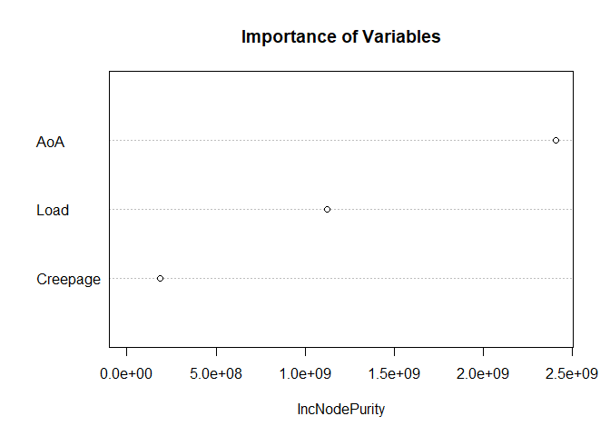

Model Selection, Lateral Force
================
Mohammad Hosseini (<mohammadhosseini@vt.edu>)

-----

### Dataset Preparation & Single Models

``` r
## Load data
load("FinalDataset.rda")

## Divide into training and testing sets
set.seed(98)
n <- nrow(data)
size <- floor(n*0.7)
train.ind <- sample(n, size, replace=FALSE)
train <- data[train.ind,]
test <- data[-train.ind,]
```

<br>

### Checking for Multicollinearity

``` r
## Correlation
c <- cor(data[, -c(1,2)])
print(c)
```

    ##                 Load           AoA     Creepage
    ## Load      1.00000000 -5.751417e-02 1.775960e-03
    ## AoA      -0.05751417  1.000000e+00 4.530105e-20
    ## Creepage  0.00177596  4.530105e-20 1.000000e+00

There is no strong correlation between the pairs of variables.

<br>

### Superposition of Main Effects

``` r
## Linear
library(sjPlot, quietly = TRUE)
multiple.reg <- lm(Lateral_Force ~ Load + AoA + Creepage, data = train)
summary(multiple.reg)
```

    ## 
    ## Call:
    ## lm(formula = Lateral_Force ~ Load + AoA + Creepage, data = train)
    ## 
    ## Residuals:
    ##      Min       1Q   Median       3Q      Max 
    ## -2721.19  -530.96   -65.04   438.00  2920.45 
    ## 
    ## Coefficients:
    ##               Estimate Std. Error t value Pr(>|t|)    
    ## (Intercept)  4.072e+01  2.086e+00   19.52   <2e-16 ***
    ## Load         1.151e-01  2.597e-04  443.14   <2e-16 ***
    ## AoA          2.271e+03  1.462e+00 1553.68   <2e-16 ***
    ## Creepage    -3.522e+01  1.459e+00  -24.14   <2e-16 ***
    ## ---
    ## Signif. codes:  0 '***' 0.001 '**' 0.01 '*' 0.05 '.' 0.1 ' ' 1
    ## 
    ## Residual standard error: 977 on 1343996 degrees of freedom
    ## Multiple R-squared:  0.654,  Adjusted R-squared:  0.654 
    ## F-statistic: 8.467e+05 on 3 and 1343996 DF,  p-value: < 2.2e-16

``` r
## Main effects per single models 
multiple.reg <- lm(Lateral_Force ~ Load + AoA + I(AoA^3) + Creepage, data = train)
summary(multiple.reg)
```

    ## 
    ## Call:
    ## lm(formula = Lateral_Force ~ Load + AoA + I(AoA^3) + Creepage, 
    ##     data = train)
    ## 
    ## Residuals:
    ##      Min       1Q   Median       3Q      Max 
    ## -2355.35  -577.66   -43.54   449.62  2728.84 
    ## 
    ## Coefficients:
    ##               Estimate Std. Error t value Pr(>|t|)    
    ## (Intercept)  3.419e+01  1.959e+00   17.45   <2e-16 ***
    ## Load         1.166e-01  2.439e-04  477.88   <2e-16 ***
    ## AoA          3.604e+03  3.428e+00 1051.37   <2e-16 ***
    ## I(AoA^3)    -2.221e+03  5.234e+00 -424.43   <2e-16 ***
    ## Creepage    -3.570e+01  1.370e+00  -26.05   <2e-16 ***
    ## ---
    ## Signif. codes:  0 '***' 0.001 '**' 0.01 '*' 0.05 '.' 0.1 ' ' 1
    ## 
    ## Residual standard error: 917.4 on 1343995 degrees of freedom
    ## Multiple R-squared:  0.6949, Adjusted R-squared:  0.6949 
    ## F-statistic: 7.652e+05 on 4 and 1343995 DF,  p-value: < 2.2e-16

<br>

## Model Selection via BIC

### Main Effects Per Single Models

``` r
train2 <- train[,-1]
train2$AoA_Cubed <- train2$AoA^3
multiple.null <- lm(Lateral_Force ~ 1, data = train2)
multiple.full <- lm(Lateral_Force ~ . + .^2, data = train2)
multiple.fwbk <- step(multiple.null, scope=formula(multiple.full),
                      direction="both", k=log(nrow(train2)), trace=0)
summary(multiple.fwbk)
```

    ## 
    ## Call:
    ## lm(formula = Lateral_Force ~ AoA + Load + AoA_Cubed + Creepage + 
    ##     AoA:Load + Load:AoA_Cubed + AoA:AoA_Cubed + AoA:Creepage + 
    ##     AoA_Cubed:Creepage + Load:Creepage, data = train2)
    ## 
    ## Residuals:
    ##      Min       1Q   Median       3Q      Max 
    ## -1554.95  -143.53     3.86   142.27  1809.80 
    ## 
    ## Coefficients:
    ##                      Estimate Std. Error t value Pr(>|t|)    
    ## (Intercept)        -1.162e+02  7.700e-01 -150.88   <2e-16 ***
    ## AoA                 6.783e+02  2.344e+00  289.33   <2e-16 ***
    ## Load                1.650e-01  1.348e-04 1223.63   <2e-16 ***
    ## AoA_Cubed          -5.113e+02  5.790e+00  -88.31   <2e-16 ***
    ## Creepage           -6.755e+01  6.946e-01  -97.25   <2e-16 ***
    ## AoA:Load            7.165e-01  2.916e-04 2457.06   <2e-16 ***
    ## Load:AoA_Cubed     -4.290e-01  4.458e-04 -962.36   <2e-16 ***
    ## AoA:AoA_Cubed       4.788e+02  9.151e-01  523.25   <2e-16 ***
    ## AoA:Creepage       -9.118e+02  2.160e+00 -422.19   <2e-16 ***
    ## AoA_Cubed:Creepage  9.395e+02  3.133e+00  299.88   <2e-16 ***
    ## Load:Creepage      -1.918e-02  1.161e-04 -165.12   <2e-16 ***
    ## ---
    ## Signif. codes:  0 '***' 0.001 '**' 0.01 '*' 0.05 '.' 0.1 ' ' 1
    ## 
    ## Residual standard error: 250.7 on 1343989 degrees of freedom
    ## Multiple R-squared:  0.9772, Adjusted R-squared:  0.9772 
    ## F-statistic: 5.762e+06 on 10 and 1343989 DF,  p-value: < 2.2e-16

<br>

### Excluding `AoA_Cubed` and Its Interactions

``` r
## Step-wise selection
multiple.null <- lm(Lateral_Force ~ 1, data = train)
multiple.full <- lm(Lateral_Force ~ .^2, data = train)
multiple.fwbk <- step(multiple.null, scope=formula(multiple.full),
                      direction="both", k=log(nrow(train)), trace=0)
summary(multiple.fwbk)
```

    ## 
    ## Call:
    ## lm(formula = Lateral_Force ~ AoA + Load + Longitudinal_Force + 
    ##     Creepage + AoA:Load + AoA:Longitudinal_Force + AoA:Creepage + 
    ##     Load:Creepage + Longitudinal_Force:Creepage + Load:Longitudinal_Force, 
    ##     data = train)
    ## 
    ## Residuals:
    ##      Min       1Q   Median       3Q      Max 
    ## -2562.38  -164.85     1.52   170.59  1824.11 
    ## 
    ## Coefficients:
    ##                               Estimate Std. Error t value Pr(>|t|)    
    ## (Intercept)                 -1.352e+02  9.184e-01  -147.2   <2e-16 ***
    ## AoA                          7.520e+02  1.524e+00   493.5   <2e-16 ***
    ## Load                         1.553e-01  2.305e-04   673.6   <2e-16 ***
    ## Longitudinal_Force          -1.136e-01  1.082e-03  -105.0   <2e-16 ***
    ## Creepage                    -1.205e+02  8.724e-01  -138.2   <2e-16 ***
    ## AoA:Load                     5.557e-01  3.772e-04  1473.3   <2e-16 ***
    ## AoA:Longitudinal_Force      -3.402e-01  1.104e-03  -308.1   <2e-16 ***
    ## AoA:Creepage                -5.700e+02  1.082e+00  -526.9   <2e-16 ***
    ## Load:Creepage                1.794e-01  3.166e-04   566.6   <2e-16 ***
    ## Longitudinal_Force:Creepage -2.341e-01  6.757e-04  -346.5   <2e-16 ***
    ## Load:Longitudinal_Force     -1.669e-05  8.950e-08  -186.5   <2e-16 ***
    ## ---
    ## Signif. codes:  0 '***' 0.001 '**' 0.01 '*' 0.05 '.' 0.1 ' ' 1
    ## 
    ## Residual standard error: 288.5 on 1343989 degrees of freedom
    ## Multiple R-squared:  0.9698, Adjusted R-squared:  0.9698 
    ## F-statistic: 4.321e+06 on 10 and 1343989 DF,  p-value: < 2.2e-16

<br>

## LASSO via LOOCV

### Main Effects Per Single Models

``` r
## Add interaction terms to data set
load("FinalDataset.rda")
var.names <- c("Longitudinal_Force", "Lateral_Force", "Load", 
               "AoA", "Creepage", "AoA_Cubed", "AoA*Load",
               "Creepage*Load", "AoA_Cubed*Load", "AoA*Creepage",
               "AoA_Cubed*Creepage")
data <- cbind(as.matrix(data), data$AoA^3,
              data$AoA*data$Load,
              data$Creepage*data$Load,
              (data$AoA^3)*data$Load,
              data$AoA*data$Creepage,
              (data$AoA^3)*data$Creepage)
colnames(data) <- var.names
head(data)
```

    ##      Longitudinal_Force Lateral_Force     Load        AoA Creepage  AoA_Cubed
    ## [1,]           256.3555     -132.3283 1711.966 -1.0000000 2.000000 -1.0000000
    ## [2,]           241.2183     -138.1878 1658.254 -0.9999958 1.999983 -0.9999875
    ## [3,]           256.3555     -182.1345 1710.990 -0.9999917 1.999967 -0.9999750
    ## [4,]           269.0512     -164.5558 1669.973 -0.9999875 1.999950 -0.9999625
    ## [5,]           278.3288     -161.6260 1556.688 -0.9999833 1.999933 -0.9999500
    ## [6,]           234.3822     -240.2417 1553.758 -0.9999792 1.999917 -0.9999375
    ##       AoA*Load Creepage*Load AoA_Cubed*Load AoA*Creepage AoA_Cubed*Creepage
    ## [1,] -1711.966      3423.933      -1711.966    -2.000000          -2.000000
    ## [2,] -1658.247      3316.480      -1658.233    -1.999975          -1.999958
    ## [3,] -1710.975      3421.922      -1710.947    -1.999950          -1.999917
    ## [4,] -1669.952      3339.862      -1669.910    -1.999925          -1.999875
    ## [5,] -1556.662      3113.272      -1556.610    -1.999900          -1.999833
    ## [6,] -1553.726      3107.387      -1553.661    -1.999875          -1.999792

``` r
## Divide into training and testing sets
set.seed(98)
n <- nrow(data)
size <- floor(n*0.7)
train.ind <- sample(n, size, replace=FALSE)
train <- data[train.ind,]
test <- data[-train.ind,]

## Reduce sampling rate
ind.100  <- seq(from = 1, to = nrow(train), by = 100)
ind.1000 <- seq(from = 1, to = nrow(train), by = 1000)
train_100  <- train[ind.100,]
train_1000 <- train[ind.1000,]

ind.100  <- seq(from = 1, to = nrow(test), by = 100)
ind.1000 <- seq(from = 1, to = nrow(test), by = 1000)
test_100  <- test[ind.100,]
test_1000 <- test[ind.1000,]

## Normalize
train.x <- scale(train_1000[,-c(1,2)], center=TRUE, scale=TRUE)
train.y <- scale(train_1000[,2], center=TRUE, scale=TRUE)

## Run LASSO
library(lars, quietly = TRUE)
lasso <- lars(train.x, train.y, type="lasso")
lasso.cv <- cv.lars(train.x, train.y, K=nrow(train.x), plot.it=TRUE)
```

<!-- -->

``` r
## CV
wm <- which.min(lasso.cv$cv)
tf <- lasso.cv$cv < lasso.cv$cv[wm] + lasso.cv$cv.error[wm]
lasso.cv.best <- lasso.cv$index[(1:nrow(train.x))[tf][1]]

## Extract beta.hat
bhat.lasso <- coef(lasso, s=lasso.cv.best, mode="fraction")
print(bhat.lasso)
```

    ##               Load                AoA           Creepage          AoA_Cubed 
    ##         0.29112361         0.11338960         0.00000000         0.00000000 
    ##           AoA*Load      Creepage*Load     AoA_Cubed*Load       AoA*Creepage 
    ##         1.42285721        -0.01855519        -0.55375252        -0.16490977 
    ## AoA_Cubed*Creepage 
    ##         0.07560055

We observe that `Creepage` and `AoA_Cubed` were left out of the model.

<br>

### Excluding `AoA_Cubed` and Its Interactions

``` r
## Normalize
train.x <- scale(train_1000[,-c(1,2,6,9,11)], center=TRUE, scale=TRUE)
train.y <- scale(train_1000[,2], center=TRUE, scale=TRUE)
head(train.x)
```

    ##             Load        AoA   Creepage    AoA*Load Creepage*Load AoA*Creepage
    ## [1,] -0.05400099  1.3737410  0.5218896  1.10447658     0.2499484    1.3841343
    ## [2,] -1.25562275  0.4460477 -0.2312372  0.05492537    -0.8986902    0.2784117
    ## [3,] -0.40486213  0.1344596  1.0465054  0.09509125     0.1541290    0.1585618
    ## [4,] -0.05772695 -0.5732763 -0.5237280 -0.43027600    -0.3378779   -0.3460824
    ## [5,]  0.04597891 -0.3305398  0.4716715 -0.25680653     0.3101109   -0.3469288
    ## [6,] -0.05772695  0.1243285  1.0880502  0.11857283     0.5630459    0.1486837

``` r
## Run LASSO
library(lars, quietly = TRUE)
lasso <- lars(train.x, train.y, type="lasso")
lasso.cv <- cv.lars(train.x, train.y, K=nrow(train.x), plot.it=FALSE)

## CV
wm <- which.min(lasso.cv$cv)
tf <- lasso.cv$cv < lasso.cv$cv[wm] + lasso.cv$cv.error[wm]
lasso.cv.best <- lasso.cv$index[(1:nrow(train.x))[tf][1]]

## Extract beta.hat
bhat.lasso <- coef(lasso, s=lasso.cv.best, mode="fraction")
print(bhat.lasso)
```

    ##          Load           AoA      Creepage      AoA*Load Creepage*Load 
    ##     0.2573184     0.3293997     0.0000000     0.9063524     0.0000000 
    ##  AoA*Creepage 
    ##    -0.3446317

LASSO drops `Creepage` (again) as well as its interactions with `Load`.

<br>

## Best Subset Selection

### Main Effects Per Single Models

``` r
## Run algo.
library(olsrr, quietly = TRUE)
best.subset.data <- as.data.frame(train_1000[,c(2,3,4,5,6)])
model <- lm(Lateral_Force ~ .^2, data = best.subset.data)
k <- ols_step_best_subset(model)
print(k); plot(k)
```

    ##                                                    Best Subsets Regression                                                    
    ## ------------------------------------------------------------------------------------------------------------------------------
    ## Model Index    Predictors
    ## ------------------------------------------------------------------------------------------------------------------------------
    ##      1         Load:AoA                                                                                                        
    ##      2         Load Load:AoA                                                                                                   
    ##      3         Load Load:AoA Load:AoA_Cubed                                                                                    
    ##      4         Load Load:AoA Load:AoA_Cubed AoA:AoA_Cubed                                                                      
    ##      5         Load Creepage Load:AoA Load:AoA_Cubed AoA:AoA_Cubed                                                             
    ##      6         Load Creepage Load:AoA Load:Creepage Load:AoA_Cubed AoA:AoA_Cubed                                               
    ##      7         Load Creepage AoA_Cubed Load:AoA Load:AoA_Cubed AoA:Creepage AoA:AoA_Cubed                                      
    ##      8         Load AoA Creepage Load:AoA Load:AoA_Cubed AoA:Creepage AoA:AoA_Cubed Creepage:AoA_Cubed                         
    ##      9         Load AoA Creepage Load:AoA Load:Creepage Load:AoA_Cubed AoA:Creepage AoA:AoA_Cubed Creepage:AoA_Cubed           
    ##     10         Load AoA Creepage AoA_Cubed Load:AoA Load:Creepage Load:AoA_Cubed AoA:Creepage AoA:AoA_Cubed Creepage:AoA_Cubed 
    ## ------------------------------------------------------------------------------------------------------------------------------
    ## 
    ##                                                                  Subsets Regression Summary                                                                 
    ## ------------------------------------------------------------------------------------------------------------------------------------------------------------
    ##                        Adj.        Pred                                                                                                                      
    ## Model    R-Square    R-Square    R-Square      C(p)          AIC             SBIC             SBC             MSEP             FPE          HSP        APC  
    ## ------------------------------------------------------------------------------------------------------------------------------------------------------------
    ##   1        0.8418      0.8417      0.8408    8310.6359    21296.2578      -9579523.7387    21311.8680    597331776.9800    445104.6596    331.4268    0.1587 
    ##   2        0.9124      0.9123      0.9116    4003.7072    20503.3107     -31325678.5144    20524.1243    330874842.7154    246736.0251    183.7213    0.0880 
    ##   3        0.9702      0.9701      0.9699     482.4533    19057.0713    -270637302.4949    19083.0884    112722349.5428     84120.3175     62.6368    0.0300 
    ##   4        0.9730      0.9729      0.9727     312.4339    18925.5118    -330137857.0028    18956.7323    102135482.0503     76276.2492     56.7964    0.0272 
    ##   5        0.9749      0.9749      0.9746     196.2352    18827.3864    -383170428.5403    18863.8103     94874009.6706     70905.7602     52.7978    0.0253 
    ##   6        0.9752      0.9751      0.9748     184.8750    18817.5852    -389933154.3135    18859.2125     94114992.3713     70390.5585     52.4146    0.0251 
    ##   7        0.9762      0.9761      0.9758     124.2451    18762.8385    -424274662.4705    18809.6692     90291551.6814     67580.8758     50.3228    0.0241 
    ##   8        0.9777      0.9776      0.9773      33.7894    18676.4291    -483923406.6258    18728.4631     84606610.8416     63372.6487     47.1897    0.0226 
    ##   9        0.9780      0.9778      0.9775      20.2826    18663.0142    -495125203.6485    18720.2517     83704514.0741     62743.2576     46.7216    0.0224 
    ##  10        0.9781      0.9780      0.9777      11.0000    18653.6864    -503513925.9258    18716.1273     83064296.4596     62309.3128     46.3990    0.0222 
    ## ------------------------------------------------------------------------------------------------------------------------------------------------------------
    ## AIC: Akaike Information Criteria 
    ##  SBIC: Sawa's Bayesian Information Criteria 
    ##  SBC: Schwarz Bayesian Criteria 
    ##  MSEP: Estimated error of prediction, assuming multivariate normality 
    ##  FPE: Final Prediction Error 
    ##  HSP: Hocking's Sp 
    ##  APC: Amemiya Prediction Criteria

<!-- --><!-- -->

<br>

### Excluding `AoA_Cubed` and Its Interactions

``` r
## Run algo.
best.subset.data <- as.data.frame(train_1000[,c(2,3,4,5)])
model <- lm(Lateral_Force ~ .^2, data = best.subset.data)
k <- ols_step_best_subset(model)
print(k); plot(k)
```

    ##                       Best Subsets Regression                       
    ## --------------------------------------------------------------------
    ## Model Index    Predictors
    ## --------------------------------------------------------------------
    ##      1         Load:AoA                                              
    ##      2         Load Load:AoA                                         
    ##      3         Load Load:AoA AoA:Creepage                            
    ##      4         Load AoA Load:AoA AoA:Creepage                        
    ##      5         Load AoA Creepage Load:AoA AoA:Creepage               
    ##      6         Load AoA Creepage Load:AoA Load:Creepage AoA:Creepage 
    ## --------------------------------------------------------------------
    ## 
    ##                                                                  Subsets Regression Summary                                                                 
    ## ------------------------------------------------------------------------------------------------------------------------------------------------------------
    ##                        Adj.        Pred                                                                                                                      
    ## Model    R-Square    R-Square    R-Square      C(p)          AIC             SBIC             SBC             MSEP             FPE          HSP        APC  
    ## ------------------------------------------------------------------------------------------------------------------------------------------------------------
    ##   1        0.8418      0.8417      0.8408    3110.3675    21296.2578      -9324314.5749    21311.8680    597331776.9800    445104.6596    331.4268    0.1587 
    ##   2        0.9124      0.9123      0.9116    1125.3154    20503.3107     -30492436.9144    20524.1243    330874842.7154    246736.0251    183.7213    0.0880 
    ##   3        0.9272      0.9270      0.9264     712.3973    20257.4092     -44104277.6456    20283.4262    275348133.5657    205481.6326    153.0037    0.0732 
    ##   4        0.9524      0.9523      0.9519       3.7252    19686.7481    -103467197.1726    19717.9685    179953088.2631    134391.5584    100.0698    0.0479 
    ##   5        0.9525      0.9523      0.9518       5.0315    19688.0509    -103560255.6714    19724.4748    179994298.0651    134521.9053    100.1676    0.0480 
    ##   6        0.9525      0.9523      0.9517       7.0000    19690.0193    -103550736.3209    19731.6465    180124781.9303    134719.0674    100.3152    0.0480 
    ## ------------------------------------------------------------------------------------------------------------------------------------------------------------
    ## AIC: Akaike Information Criteria 
    ##  SBIC: Sawa's Bayesian Information Criteria 
    ##  SBC: Schwarz Bayesian Criteria 
    ##  MSEP: Estimated error of prediction, assuming multivariate normality 
    ##  FPE: Final Prediction Error 
    ##  HSP: Hocking's Sp 
    ##  APC: Amemiya Prediction Criteria

<!-- --><!-- -->

<br>

## Principle Component Analysis via LOOCV

### Main Effects Per Single Models

``` r
## Normalize
train.x <- scale(train_1000[,-c(1,2)], center=TRUE, scale=TRUE)
train.y <- scale(train_1000[,2], center=TRUE, scale=TRUE)

## CV
library(pls, quietly = TRUE)
pcr.cv <- pcr(train.y ~ train.x, validation="LOO")
plot(RMSEP(pcr.cv), main="Principle Component Analysis", xlab="Number of Components")
```

<!-- -->

``` r
## Pick optimal number of components
a <- RMSEP(pcr.cv, estimate="CV", intercept=FALSE)$val
a[!is.finite(a)] <- 1
ncomp <- which.min(a + (max(a)-min(a))*seq(0,1,length=length(a)))
cat("Optimal Number of Components: ", ncomp)
```

    ## Optimal Number of Components:  5

``` r
## Extract beta.hat 
pcr <- pcr(train.y ~ train.x, ncomp=ncomp)
bhat.pcr <- drop(coef(pcr.cv, ncomp=ncomp, intercept=TRUE))

## Visualizations
library(FactoMineR, quietly = TRUE)
library(factoextra, quietly = TRUE)
library(corrplot, quietly = TRUE)
library(knitr, quietly = TRUE)
train.pca <- PCA(as.matrix(train_1000[,-c(1, 2)]), graph = FALSE)
var <- get_pca_var(train.pca)
fviz_eig(train.pca, addlabels = TRUE)
```

<!-- -->

``` r
fviz_pca_var(train.pca, col.var = "contrib", gradient.cols = c("#00AFBB", "#E7B800", "#FC4E07"))
```

<!-- -->

``` r
# Contributions of variables to PC1 & PC2
fviz_contrib(train.pca, choice = "var", axes = 1, top = 10)
```

<!-- -->

``` r
fviz_contrib(train.pca, choice = "var", axes = 2, top = 10)
```

<!-- -->

<br>

### Excluding `AoA_Cubed` and Its Interactions

``` r
## Normalize
train.x <- scale(train_1000[,-c(1,2,6,9,11)], center=TRUE, scale=TRUE)
train.y <- scale(train_1000[,2], center=TRUE, scale=TRUE)

## CV
library(pls, quietly = TRUE)
pcr.cv <- pcr(train.y ~ train.x, validation="LOO")
plot(RMSEP(pcr.cv), main="Principle Component Analysis", xlab="Number of Components")
```

<!-- -->

``` r
## Pick optimal number of components
a <- RMSEP(pcr.cv, estimate="CV", intercept=FALSE)$val
a[!is.finite(a)] <- 1
ncomp <- which.min(a + (max(a)-min(a))*seq(0,1,length=length(a)))
cat("Optimal Number of Components: ", ncomp)
```

    ## Optimal Number of Components:  4

``` r
## Extract beta.hat 
pcr <- pcr(train.y ~ train.x, ncomp=ncomp)
bhat.pcr <- drop(coef(pcr.cv, ncomp=ncomp, intercept=TRUE))

## Visualizations
library(FactoMineR, quietly = TRUE)
library(factoextra, quietly = TRUE)
library(corrplot, quietly = TRUE)
library(knitr, quietly = TRUE)
train.pca <- PCA(as.matrix(train_1000[,-c(1,2,6,9,11)]), graph = FALSE)
var <- get_pca_var(train.pca)
fviz_eig(train.pca, addlabels = TRUE)
```

<!-- -->

``` r
fviz_pca_var(train.pca, col.var = "contrib", gradient.cols = c("#00AFBB", "#E7B800", "#FC4E07"))
```

<!-- -->

``` r
# Contributions of variables to PC1 & PC2
fviz_contrib(train.pca, choice = "var", axes = 1, top = 10)
```

<!-- -->

``` r
fviz_contrib(train.pca, choice = "var", axes = 2, top = 10)
```

<!-- -->

<br>

## Importantance of Variables

### Random Forest Model

``` r
## Load libraries
library(randomForest, quietly = TRUE)
library(caret, quietly = TRUE)
library(dplyr, quietly = TRUE)
library(MLmetrics, quietly = TRUE)

## Fit RandomForest (tuned via grid search)
set.seed(98)
model <- randomForest(Lateral_Force ~ AoA + Load + Creepage, 
                      data = train_1000, ntree = 17, nodesize = 10, importance=TRUE)
importance(model)
```

    ##            %IncMSE IncNodePurity
    ## AoA      34.025505    2408054221
    ## Load     36.681652    1125878492
    ## Creepage  5.920609     185339752

``` r
varImpPlot(model, type=2, main="Importance of Variables")
```

<!-- -->

<br>

## Wrapping Up\!

``` r
## Best Model
multiple.reg <- lm(Lateral_Force ~ ., data = as.data.frame(train_1000[,-c(1,5,6,8,9,11)]))
summary(multiple.reg)
```

    ## 
    ## Call:
    ## lm(formula = Lateral_Force ~ ., data = as.data.frame(train_1000[, 
    ##     -c(1, 5, 6, 8, 9, 11)]))
    ## 
    ## Residuals:
    ##     Min      1Q  Median      3Q     Max 
    ## -1323.4  -207.1   -10.0   181.5  1515.4 
    ## 
    ## Coefficients:
    ##                  Estimate Std. Error t value Pr(>|t|)    
    ## (Intercept)    -7.423e+01  1.776e+01   -4.18  3.1e-05 ***
    ## Load            1.436e-01  3.182e-03   45.13  < 2e-16 ***
    ## AoA             1.209e+03  4.534e+01   26.67  < 2e-16 ***
    ## `AoA*Load`      4.599e-01  5.399e-03   85.18  < 2e-16 ***
    ## `AoA*Creepage` -9.863e+02  2.948e+01  -33.45  < 2e-16 ***
    ## ---
    ## Signif. codes:  0 '***' 0.001 '**' 0.01 '*' 0.05 '.' 0.1 ' ' 1
    ## 
    ## Residual standard error: 365.9 on 1339 degrees of freedom
    ## Multiple R-squared:  0.9524, Adjusted R-squared:  0.9523 
    ## F-statistic:  6705 on 4 and 1339 DF,  p-value: < 2.2e-16

``` r
## Simplest model
multiple.reg <- lm(Lateral_Force ~ ., data = as.data.frame(train_1000[,-c(1,5,6,8,9,10,11)]))
summary(multiple.reg)
```

    ## 
    ## Call:
    ## lm(formula = Lateral_Force ~ ., data = as.data.frame(train_1000[, 
    ##     -c(1, 5, 6, 8, 9, 10, 11)]))
    ## 
    ## Residuals:
    ##      Min       1Q   Median       3Q      Max 
    ## -1874.39  -285.02   -36.11   232.22  2302.36 
    ## 
    ## Coefficients:
    ##               Estimate Std. Error t value Pr(>|t|)    
    ## (Intercept) -80.662355  24.050041  -3.354 0.000819 ***
    ## Load          0.141656   0.004308  32.879  < 2e-16 ***
    ## AoA          84.099432  41.175548   2.042 0.041301 *  
    ## `AoA*Load`    0.457078   0.007311  62.517  < 2e-16 ***
    ## ---
    ## Signif. codes:  0 '***' 0.001 '**' 0.01 '*' 0.05 '.' 0.1 ' ' 1
    ## 
    ## Residual standard error: 495.6 on 1340 degrees of freedom
    ## Multiple R-squared:  0.9127, Adjusted R-squared:  0.9125 
    ## F-statistic:  4670 on 3 and 1340 DF,  p-value: < 2.2e-16

-----
