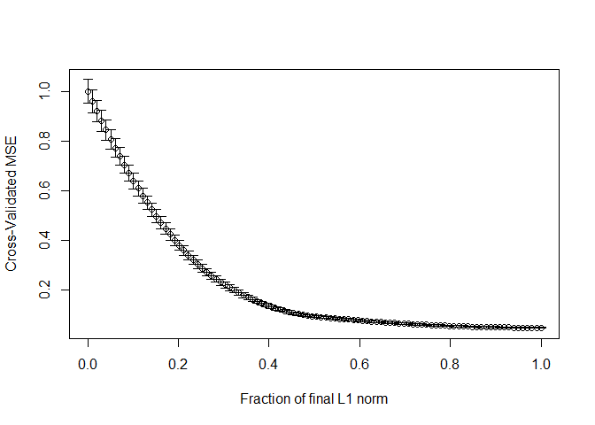
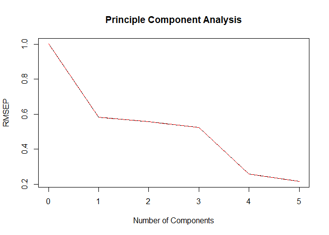
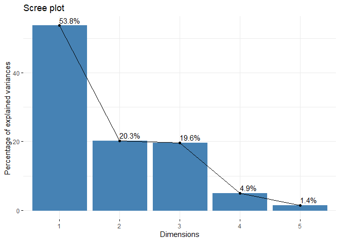
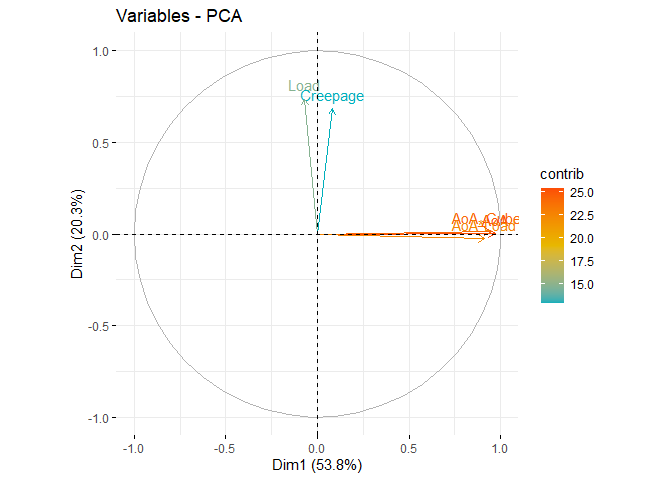
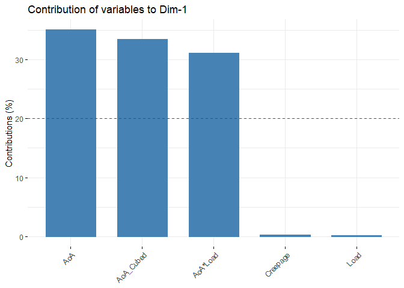
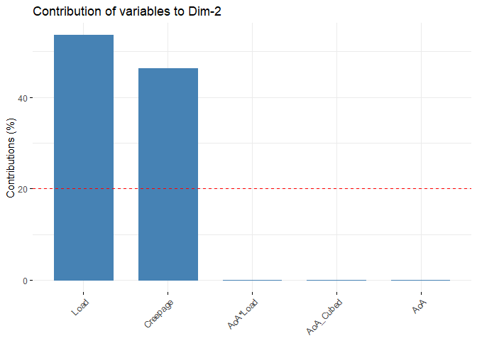
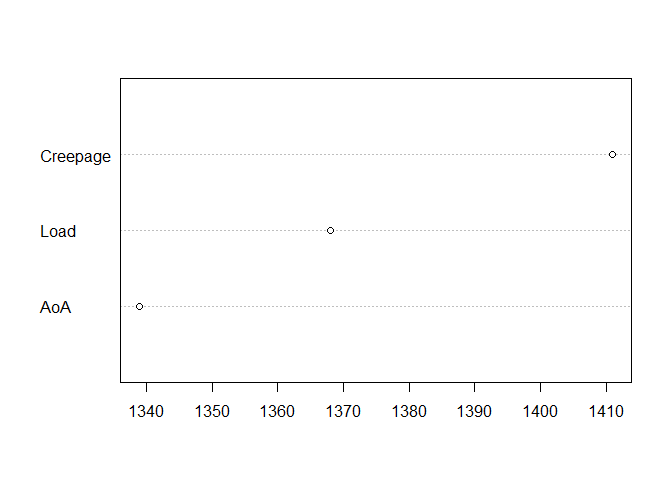
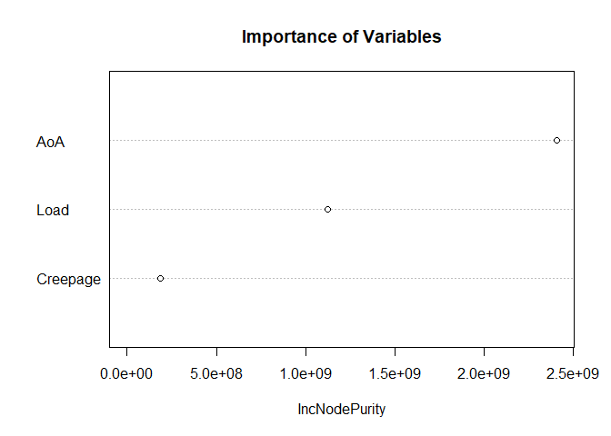
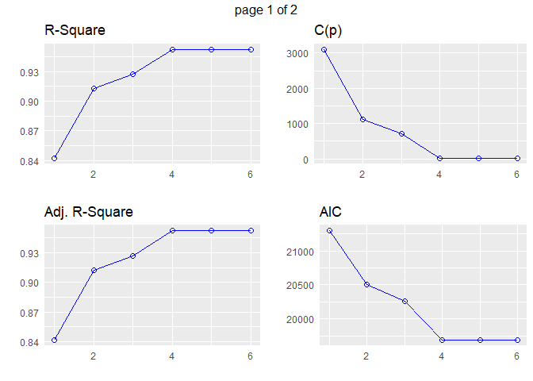

Importance Analysis, Lateral Force
================
Mohammad Hosseini (<mohammadhosseini@vt.edu>)

-----

### Training & Testing Sets

``` r
## Load data
load("FinalDataset.rda")
var.names <- c("Longitudinal_Force", "Lateral_Force", "Load", 
               "AoA", "Creepage", "AoA_Cubed", "AoA*Load")
data <- cbind(as.matrix(data), data$AoA^3, data$AoA*data$Load)
colnames(data) <- var.names
head(data)
```

    ##      Longitudinal_Force Lateral_Force     Load        AoA Creepage  AoA_Cubed
    ## [1,]           256.3555     -132.3283 1711.966 -1.0000000 2.000000 -1.0000000
    ## [2,]           241.2183     -138.1878 1658.254 -0.9999958 1.999983 -0.9999875
    ## [3,]           256.3555     -182.1345 1710.990 -0.9999917 1.999967 -0.9999750
    ## [4,]           269.0512     -164.5558 1669.973 -0.9999875 1.999950 -0.9999625
    ## [5,]           278.3288     -161.6260 1556.688 -0.9999833 1.999933 -0.9999500
    ## [6,]           234.3822     -240.2417 1553.758 -0.9999792 1.999917 -0.9999375
    ##       AoA*Load
    ## [1,] -1711.966
    ## [2,] -1658.247
    ## [3,] -1710.975
    ## [4,] -1669.952
    ## [5,] -1556.662
    ## [6,] -1553.726

``` r
## Divide into training and testing sets
set.seed(98)
n <- nrow(data)
size <- floor(n*0.7)
train.ind <- sample(n, size, replace=FALSE)
train <- data[train.ind,]
test <- data[-train.ind,]

## Decrease the sampling rate
ind.100  <- seq(from = 1, to = nrow(train), by = 100)
ind.1000 <- seq(from = 1, to = nrow(train), by = 1000)
train_100  <- train[ind.100,]
train_1000 <- train[ind.1000,]

ind.100  <- seq(from = 1, to = nrow(test), by = 100)
ind.1000 <- seq(from = 1, to = nrow(test), by = 1000)
test_100  <- test[ind.100,]
test_1000 <- test[ind.1000,]
```

<br>

### LASSO

``` r
## Normalize
train.x <- scale(train_1000[,-c(1,2)], center=TRUE, scale=TRUE)
train.y <- scale(train_1000[,2], center=TRUE, scale=TRUE)

## Run LASSO
library(lars, quietly = TRUE)
lasso <- lars(train.x, train.y, type="lasso")
lasso.cv <- cv.lars(train.x, train.y, K=nrow(train.x), plot.it=TRUE)
```

<!-- -->

``` r
wm <- which.min(lasso.cv$cv)
tf <- lasso.cv$cv < lasso.cv$cv[wm] + lasso.cv$cv.error[wm]
lasso.cv.best <- lasso.cv$index[(1:nrow(train.x))[tf][1]]
bhat.lasso <- coef(lasso, s=lasso.cv.best, mode="fraction")
print(bhat.lasso)
```

    ##       Load        AoA   Creepage  AoA_Cubed   AoA*Load 
    ##  0.2605698  0.3948915  0.0000000 -0.4058963  0.9080437

``` r
## Get shrinkage stages
train.x.names <- var.names[-c(1,2)]
for (i in 1:nrow(coef(lasso))){
  print(train.x.names[-coef(lasso)[i,] != 0])}
```

    ## character(0)
    ## [1] "AoA*Load"
    ## [1] "Load"     "AoA*Load"
    ## [1] "Load"     "AoA"      "AoA*Load"
    ## [1] "Load"      "AoA"       "AoA_Cubed" "AoA*Load" 
    ## [1] "Load"      "AoA"       "Creepage"  "AoA_Cubed" "AoA*Load"

<br>

### Principle Component Analysis

``` r
## PCA
library(pls, quietly = TRUE)
pcr.cv <- pcr(train.y ~ train.x, validation="LOO")
plot(RMSEP(pcr.cv), main="Principle Component Analysis", xlab="Number of Components")
```

<!-- -->

``` r
a <- RMSEP(pcr.cv, estimate="CV", intercept=FALSE)$val
a[!is.finite(a)] <- 1
ncomp <- which.min(a + (max(a)-min(a))*seq(0,1,length=length(a)))
pcr <- pcr(train.y ~ train.x, ncomp=ncomp)
bhat.pcr <- drop(coef(pcr.cv, ncomp=ncomp, intercept=TRUE))
print(bhat.pcr)
```

    ##   (Intercept)          Load           AoA      Creepage     AoA_Cubed 
    ## -1.844570e-17  2.695753e-01  8.747832e-02 -3.289890e-03 -1.892269e-01 
    ##      AoA*Load 
    ##  1.013765e+00

``` r
## Load libraries
library(FactoMineR, quietly = TRUE)
library(factoextra, quietly = TRUE)
library(corrplot, quietly = TRUE)
library(knitr, quietly = TRUE)

train.pca <- PCA(as.matrix(train_1000[,-c(1, 2)]), graph = FALSE)
var <- get_pca_var(train.pca)
fviz_eig(train.pca, addlabels = TRUE)
```

<!-- -->

``` r
kable(head(var$coord, 6))
```

|            |       Dim.1 |       Dim.2 |       Dim.3 |       Dim.4 |       Dim.5 |
| :--------- | ----------: | ----------: | ----------: | ----------: | ----------: |
| Load       | \-0.0689073 |   0.7366715 |   0.6725103 |   0.0172031 | \-0.0009104 |
| AoA        |   0.9708106 |   0.0017999 |   0.0424504 | \-0.1169856 | \-0.2050266 |
| Creepage   |   0.0839377 |   0.6852187 | \-0.7234834 |   0.0012624 | \-0.0001424 |
| AoA\_Cubed |   0.9486131 |   0.0140547 |   0.0507083 | \-0.2659844 |   0.1631462 |
| AoA\*Load  |   0.9140791 | \-0.0238858 |   0.0194234 |   0.4014604 |   0.0483860 |

``` r
fviz_pca_var(train.pca, col.var = "contrib",
             gradient.cols = c("#00AFBB", "#E7B800", "#FC4E07"))
```

<!-- -->

``` r
# Contributions of variables to PC1
fviz_contrib(train.pca, choice = "var", axes = 1, top = 10)
```

<!-- -->

``` r
# Contributions of variables to PC2
fviz_contrib(train.pca, choice = "var", axes = 2, top = 10)
```

<!-- -->

<br>

### Random Forest Model

``` r
## Load libraries
library(randomForest, quietly = TRUE)
library(caret, quietly = TRUE)
library(dplyr, quietly = TRUE)
library(MLmetrics, quietly = TRUE)

## Grid search
g.search <- as.data.frame(matrix(NA, nrow=40, ncol=20))
colnames(g.search) <- 1:20
rownames(g.search) <- seq(10, 400, by=10)
for (ntree in c(1:20)){
  for (nodesize in seq(10, 400, by=10)){
    set.seed(98)
    model <- randomForest(Lateral_Force ~ AoA + Load + Creepage, 
                          data = train_1000, ntree = ntree, nodesize = nodesize, importance=TRUE)
    fitted <- model %>% predict(train_1000)
    predictions <- model %>% predict(test_1000)
    g.search[(nodesize/10), ntree] = RMSE(predictions, test_1000[,2])
  }
}
which(g.search == min(g.search), arr.ind = TRUE)
```

    ##    row col
    ## 10   1  17

``` r
## Fit RandomForest
set.seed(98)
model <- randomForest(Lateral_Force ~ AoA + Load + Creepage, 
                      data = train_1000, ntree = 17, nodesize = 10, importance=TRUE)
fitted <- model %>% predict(train_1000)

# Make predictions
predictions <- model %>% predict(test_1000)

# Model performance
performance <- data.frame(
  R2.train = R2_Score(fitted, train_1000[,2]),
  RMSE = RMSE(predictions, test_1000[,2])
)
print(performance)
```

    ##    R2.train     RMSE
    ## 1 0.9909153 258.5696

``` r
vu <- varUsed(model, count=TRUE)
vusorted <- sort(vu, decreasing = FALSE, index.return = TRUE)
dotchart(vusorted$x, names(model$forest$xlevels[vusorted$ix]))
```

<!-- -->

``` r
importance(model)
```

    ##            %IncMSE IncNodePurity
    ## AoA      34.025505    2408054221
    ## Load     36.681652    1125878492
    ## Creepage  5.920609     185339752

``` r
varImpPlot(model, type=2, main="Importance of Variables")
```

<!-- -->

<br>

### Best Subset

``` r
## Best subset
library(olsrr, quietly = TRUE)
best.subset.data <- as.data.frame(train_1000[,-c(1,6,7,8)])
model <- lm(Lateral_Force ~ .^2, data = best.subset.data)
k <- ols_step_best_subset(model)
print(k); plot(k)
```

    ##                       Best Subsets Regression                       
    ## --------------------------------------------------------------------
    ## Model Index    Predictors
    ## --------------------------------------------------------------------
    ##      1         Load:AoA                                              
    ##      2         Load Load:AoA                                         
    ##      3         Load Load:AoA AoA:Creepage                            
    ##      4         Load AoA Load:AoA AoA:Creepage                        
    ##      5         Load AoA Creepage Load:AoA AoA:Creepage               
    ##      6         Load AoA Creepage Load:AoA Load:Creepage AoA:Creepage 
    ## --------------------------------------------------------------------
    ## 
    ##                                                                  Subsets Regression Summary                                                                 
    ## ------------------------------------------------------------------------------------------------------------------------------------------------------------
    ##                        Adj.        Pred                                                                                                                      
    ## Model    R-Square    R-Square    R-Square      C(p)          AIC             SBIC             SBC             MSEP             FPE          HSP        APC  
    ## ------------------------------------------------------------------------------------------------------------------------------------------------------------
    ##   1        0.8418      0.8417      0.8408    3110.3675    21296.2578      -9324314.5749    21311.8680    597331776.9800    445104.6596    331.4268    0.1587 
    ##   2        0.9124      0.9123      0.9116    1125.3154    20503.3107     -30492436.9144    20524.1243    330874842.7154    246736.0251    183.7213    0.0880 
    ##   3        0.9272      0.9270      0.9264     712.3973    20257.4092     -44104277.6456    20283.4262    275348133.5657    205481.6326    153.0037    0.0732 
    ##   4        0.9524      0.9523      0.9519       3.7252    19686.7481    -103467197.1726    19717.9685    179953088.2631    134391.5584    100.0698    0.0479 
    ##   5        0.9525      0.9523      0.9518       5.0315    19688.0509    -103560255.6714    19724.4748    179994298.0651    134521.9053    100.1676    0.0480 
    ##   6        0.9525      0.9523      0.9517       7.0000    19690.0193    -103550736.3209    19731.6465    180124781.9303    134719.0674    100.3152    0.0480 
    ## ------------------------------------------------------------------------------------------------------------------------------------------------------------
    ## AIC: Akaike Information Criteria 
    ##  SBIC: Sawa's Bayesian Information Criteria 
    ##  SBC: Schwarz Bayesian Criteria 
    ##  MSEP: Estimated error of prediction, assuming multivariate normality 
    ##  FPE: Final Prediction Error 
    ##  HSP: Hocking's Sp 
    ##  APC: Amemiya Prediction Criteria

<!-- --><!-- -->

-----
