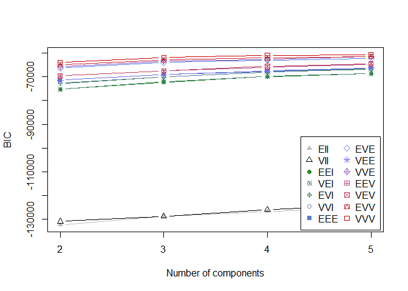
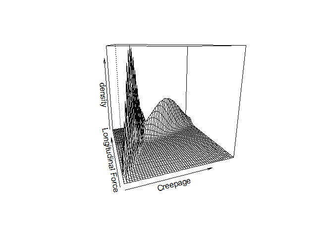
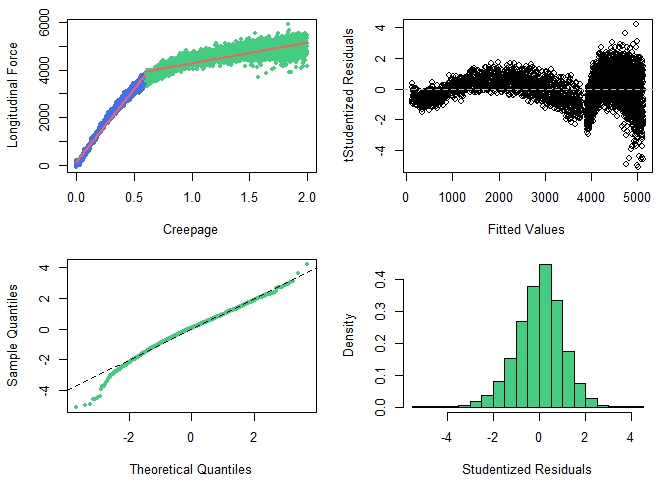

Locally Linear Model via Clustering Creepage
================
Mohammad Hosseini (<mohammadhosseini@vt.edu>)

  - [Data Set](#data-set)
  - [I. Clustering](#i.-clustering)
  - [II. Locally Linear Regression
    Model](#ii.-locally-linear-regression-model)
  - [III. Assumptions Check](#iii.-assumptions-check)

<br>

### Data Set

``` r
load("creepage_sweep_100.rda")
data <- creepage_sweep_100

## Training and testing data sets
n <- nrow(data)
size <- floor(n*0.7)
train.ind <- sample(n, size, replace=FALSE)
test.ind <- setdiff(n, train.ind)
train <- data[train.ind,]
test <- data[test.ind,]
```

<br>

### I. Clustering

``` r
library(mclust, quietly = TRUE)
library(sjPlot, quietly = TRUE)
creepage.clusters <- Mclust(data=train[, c(5, 1)], G=2:5, modelNames = mclust.options("emModelNames"))
plot(creepage.clusters$BIC)
```

<!-- -->

<br>

There is not much difference in BIC and the slopes of the lines is very
small, so we take the simplest case of two clusters.

``` r
## 2 clusters
creepage.2clusters <- Mclust(data=train[, c(5, 1)], G=2, modelNames = mclust.options("emModelNames"))
mclust2Dplot(data=train[, c(5, 1)], parameters=creepage.2clusters$parameters, z=creepage.2clusters$z,
             xlab="Creepage", ylab="Longitudinal Force", col=c("seagreen3", "royalblue2"))
abline(v=0.6, col=8, lty=2, lwd=2); text(0.35, 5000, "0.6% Creepage", col=2)
```

<!-- -->

``` r
## Density plot
x <- seq(min(train$creepage), max(train$creepage), length=50) 
y <- seq(min(train$longitudinal.force), max(train$longitudinal.force), length=50) 
xy <- expand.grid(x,y)
xyD <- matrix(dens(modelName=creepage.2clusters$modelName, data=xy, 
                   parameters=creepage.2clusters$parameters), 
                   nrow=length(x), ncol=length(y))
persp(x, y, xyD, theta=-20, xlab="Creepage", ylab="Longitudinal Force", zlab="density")
```

<!-- -->

### II. Locally Linear Regression Model

``` r
## Add categories to train
train$creepage.clusters <- as.factor(ifelse(train$creepage < 0.6, "C1", "C2"))

# Run linear regression
lm.creep.clust <- lm(longitudinal.force ~ creepage*creepage.clusters, data=train)
summary(lm.creep.clust)
```

    ## 
    ## Call:
    ## lm(formula = longitudinal.force ~ creepage * creepage.clusters, 
    ##     data = train)
    ## 
    ## Residuals:
    ##      Min       1Q   Median       3Q      Max 
    ## -1104.13  -129.93    13.42   141.34   909.71 
    ## 
    ## Coefficients:
    ##                              Estimate Std. Error t value Pr(>|t|)    
    ## (Intercept)                    120.29      11.22   10.72   <2e-16 ***
    ## creepage                      6141.38      32.33  189.99   <2e-16 ***
    ## creepage.clustersC2           3279.68      17.41  188.37   <2e-16 ***
    ## creepage:creepage.clustersC2 -5273.64      33.91 -155.52   <2e-16 ***
    ## ---
    ## Signif. codes:  0 '***' 0.001 '**' 0.01 '*' 0.05 '.' 0.1 ' ' 1
    ## 
    ## Residual standard error: 218.6 on 4196 degrees of freedom
    ## Multiple R-squared:  0.976,  Adjusted R-squared:  0.976 
    ## F-statistic: 5.69e+04 on 3 and 4196 DF,  p-value: < 2.2e-16

<br>

### III. Assumptions Check

``` r
par(mfrow = c(2,2), mai=c(.7,.7,.2,.2))
x1.grid <- with(subset(train, creepage.clusters=="C1"), seq(min(creepage), max(creepage), length=100))
x2.grid <- with(subset(train, creepage.clusters=="C2"), seq(min(creepage), max(creepage), length=100))
y1.grid <- with(subset(train, creepage.clusters=="C2"), 
                coef(lm.creep.clust)[1] + coef(lm.creep.clust)[2]*x1.grid)
y2.grid <- with(subset(train, creepage.clusters=="C2"), 
                (coef(lm.creep.clust)[1] + coef(lm.creep.clust)[3]) +
                (coef(lm.creep.clust)[2] + coef(lm.creep.clust)[4])*x2.grid)
plot(train$creepage, train$longitudinal.force, xlab="Creepage", ylab="Longitudinal Force",
     col=ifelse(train$creepage.clusters=="C1", "royalblue2", "seagreen3"), pch=20, main="")
lines(x1.grid, y1.grid, col="indianred2", lwd=2)
lines(x2.grid, y2.grid, col="indianred2", lwd=2)
plot(lm.creep.clust$fitted, rstudent(lm.creep.clust), xlab="Fitted Values", 
     ylab="tStudentized Residuals", col=1, main=""); abline(h=0, col=8, lty=2)
qqnorm(rstudent(lm.creep.clust), pch=20, col="seagreen3", main=""); abline(a=0, b=1, lty=2)
hist(rstudent(lm.creep.clust),freq=FALSE, col="seagreen3", xlab="Studentized Residuals", main="")
```

<!-- -->

-----
