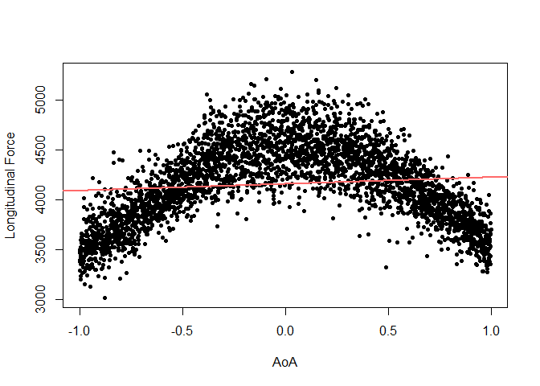
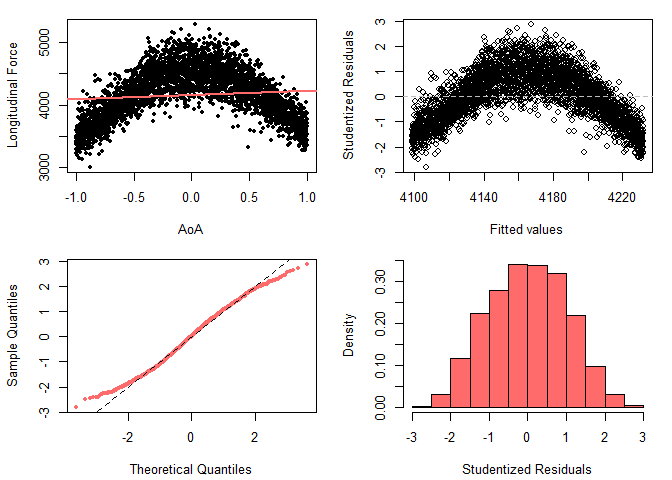
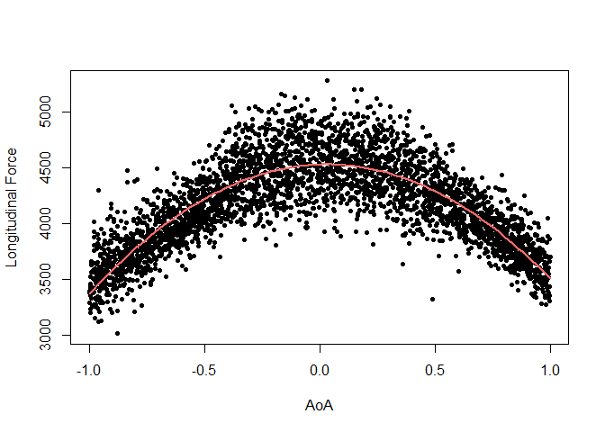
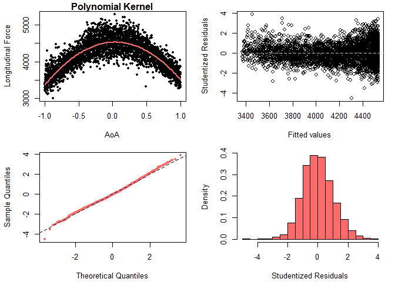
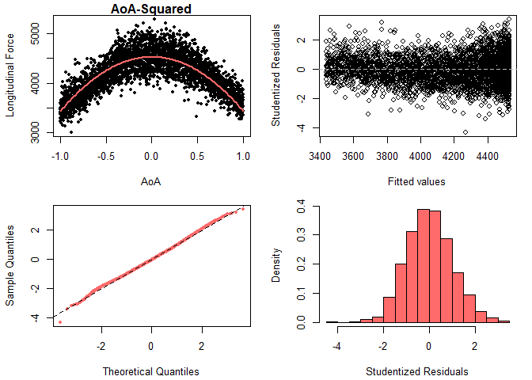

SLR Analysis for Modeling AoA 
================
Mohammad Hosseini (<mohammadhosseini@vt.edu>)

  - [1. Regressing Longitudinal Force on
    AoA](#regressing-longitudinal-force-on-aoa)
  - [2. AoA with a Polynomial Kernel](#aoa-with-a-polynomial-kernel)
  - [3. AoA, Only Quadratic Term](#aoa-only-quadratic-term)
  - [4. Comparing Models via ANOVA](#comparing-models-via-anova)

-----

### 1\. Regressing Longitudinal Force on AoA

``` r
load("longForce_AoA_100.rda")
data <- longForce_AoA_100

## Training and testing data sets
n <- nrow(data)
size <- floor(n*0.7)
train.ind <- sample(n, size, replace=FALSE)
train <- data[train.ind,]
test <- data[-train.ind,]

# Running linear regressions
lm.AoA <- lm(train$longitudinal.force ~ train$AoA)

# Plotting the regression lines
plot(train$AoA, train$longitudinal.force, xlab="AoA",
     ylab="Longitudinal Force", col=1, pch=20, main=""); abline(lm.AoA, col="indianred1", lwd=2)
```

<!-- -->

``` r
summary(lm.AoA)
```

    ## 
    ## Call:
    ## lm(formula = train$longitudinal.force ~ train$AoA)
    ## 
    ## Residuals:
    ##     Min      1Q  Median      3Q     Max 
    ## -1093.5  -292.2     6.3   288.7  1114.9 
    ## 
    ## Coefficients:
    ##             Estimate Std. Error t value Pr(>|t|)    
    ## (Intercept) 4165.231      6.751 616.952  < 2e-16 ***
    ## train$AoA     66.661     11.683   5.706 1.26e-08 ***
    ## ---
    ## Signif. codes:  0 '***' 0.001 '**' 0.01 '*' 0.05 '.' 0.1 ' ' 1
    ## 
    ## Residual standard error: 391.3 on 3358 degrees of freedom
    ## Multiple R-squared:  0.009602,   Adjusted R-squared:  0.009307 
    ## F-statistic: 32.56 on 1 and 3358 DF,  p-value: 1.258e-08

<br>

#### 1.1 Checking SLR Assumptions

``` r
par(mfrow = c(2, 2), mai=c(.7,.7,.2,.2))
plot(train$AoA, train$longitudinal.force, xlab="AoA",
     ylab="Longitudinal Force", col=1, pch=20, main=""); abline(lm.AoA, col="indianred1", lwd=2)
## AoA
plot(lm.AoA$fitted, rstudent(lm.AoA),xlab="Fitted values", ylab="Studentized Residuals",
     col=1, main=""); abline(h=0, col=8, lty=2)
qqnorm(rstudent(lm.AoA), pch=20, col="indianred1", main=""); abline(a=0, b=1, lty=2)
hist(rstudent(lm.AoA),freq=FALSE, col="indianred1", xlab="Studentized Residuals", main="")
```

<!-- -->

<br>

### 2\. AoA with a Polynomial Kernel

``` r
# Running linear regression
train$AoA2 <- train$AoA^2
lm.AoA2 <- lm(longitudinal.force ~ AoA + AoA2, data=train)

# Plotting the regression lines
plot(train$AoA, train$longitudinal.force, xlab="AoA", ylab="Longitudinal Force",
     col=1, pch=20, main="")
xgrid <- seq(-1,1,length=100)
ygrid <- lm.AoA2$coef[1] + lm.AoA2$coef[2]*xgrid + lm.AoA2$coef[3]*xgrid^2
lines(xgrid, ygrid, col="indianred1", lwd=2)

library(sjPlot, quietly = TRUE)
```

<!-- -->

``` r
summary(lm.AoA2)
```

    ## 
    ## Call:
    ## lm(formula = longitudinal.force ~ AoA + AoA2, data = train)
    ## 
    ## Residuals:
    ##     Min      1Q  Median      3Q     Max 
    ## -979.72 -144.95   -3.89  136.33  767.70 
    ## 
    ## Coefficients:
    ##              Estimate Std. Error t value Pr(>|t|)    
    ## (Intercept)  4530.476      5.645  802.63   <2e-16 ***
    ## AoA            71.124      6.496   10.95   <2e-16 ***
    ## AoA2        -1093.751     12.624  -86.64   <2e-16 ***
    ## ---
    ## Signif. codes:  0 '***' 0.001 '**' 0.01 '*' 0.05 '.' 0.1 ' ' 1
    ## 
    ## Residual standard error: 217.6 on 3357 degrees of freedom
    ## Multiple R-squared:  0.694,  Adjusted R-squared:  0.6938 
    ## F-statistic:  3806 on 2 and 3357 DF,  p-value: < 2.2e-16

<br>

#### 2.1 Checking SLR Assumptions

``` r
par(mfrow = c(2, 2), mai=c(.7,.7,.2,.2))
plot(train$AoA, train$longitudinal.force, xlab="AoA", ylab="Longitudinal Force",
     col=1, pch=20, main="Polynomial Kernel")
xgrid <- seq(-1,1,length=100)
ygrid <- lm.AoA2$coef[1] + lm.AoA2$coef[2]*xgrid + lm.AoA2$coef[3]*xgrid^2
lines(xgrid, ygrid, col="indianred1", lwd=2)
## AoA
plot(lm.AoA2$fitted, rstudent(lm.AoA2),xlab="Fitted values", ylab="Studentized Residuals",
     col=1, main=""); abline(h=0, col=8, lty=2)
qqnorm(rstudent(lm.AoA2), pch=20, col="indianred1", main=""); abline(a=0, b=1, lty=2)
hist(rstudent(lm.AoA2),freq=FALSE, col="indianred1", xlab="Studentized Residuals", main="")
```

<!-- -->
<br>

### 3\. AoA, Only Quadratic Term

``` r
# Running linear regression
lm.AoA3 <- lm(longitudinal.force ~ AoA2, data=train)

# Plotting the regression lines
plot(train$AoA, train$longitudinal.force, xlab="AoA", ylab="Longitudinal Force",
     col=1, pch=20, main="")
xgrid <- seq(-1,1,length=100)
ygrid <- lm.AoA3$coef[1] + lm.AoA3$coef[2]*xgrid^2
lines(xgrid, ygrid, col="indianred1", lwd=2)
```

<!-- -->

``` r
summary(lm.AoA3)
```

    ## 
    ## Call:
    ## lm(formula = longitudinal.force ~ AoA2, data = train)
    ## 
    ## Residuals:
    ##     Min      1Q  Median      3Q     Max 
    ## -944.98 -151.39   -3.97  142.36  753.40 
    ## 
    ## Coefficients:
    ##              Estimate Std. Error t value Pr(>|t|)    
    ## (Intercept)  4530.265      5.744  788.76   <2e-16 ***
    ## AoA2        -1092.654     12.845  -85.06   <2e-16 ***
    ## ---
    ## Signif. codes:  0 '***' 0.001 '**' 0.01 '*' 0.05 '.' 0.1 ' ' 1
    ## 
    ## Residual standard error: 221.4 on 3358 degrees of freedom
    ## Multiple R-squared:  0.683,  Adjusted R-squared:  0.6829 
    ## F-statistic:  7236 on 1 and 3358 DF,  p-value: < 2.2e-16

<br>

#### 3.1 Checking SLR Assumptions

``` r
par(mfrow = c(2, 2), mai=c(.7,.7,.2,.2))
plot(train$AoA, train$longitudinal.force, xlab="AoA", ylab="Longitudinal Force",
     col=1, pch=20, main="AoA-Squared")
xgrid <- seq(-1,1,length=100)
ygrid <- lm.AoA3$coef[1] + lm.AoA3$coef[2]*xgrid^2
lines(xgrid, ygrid, col="indianred1", lwd=2)
## AoA
plot(lm.AoA3$fitted, rstudent(lm.AoA3),xlab="Fitted values", ylab="Studentized Residuals",
     col=1, main=""); abline(h=0, col=8, lty=2)
qqnorm(rstudent(lm.AoA3), pch=20, col="indianred1", main=""); abline(a=0, b=1, lty=2)
hist(rstudent(lm.AoA3),freq=FALSE, col="indianred1", xlab="Studentized Residuals", main="")
```

<!-- -->

<br>

### 4\. Comparing Models via ANOVA

``` r
anova(lm.AoA2,lm.AoA3)
```

    ## Analysis of Variance Table
    ## 
    ## Model 1: longitudinal.force ~ AoA + AoA2
    ## Model 2: longitudinal.force ~ AoA2
    ##   Res.Df       RSS Df Sum of Sq     F    Pr(>F)    
    ## 1   3357 158915753                                 
    ## 2   3358 164591482 -1  -5675728 119.9 < 2.2e-16 ***
    ## ---
    ## Signif. codes:  0 '***' 0.001 '**' 0.01 '*' 0.05 '.' 0.1 ' ' 1

-----
