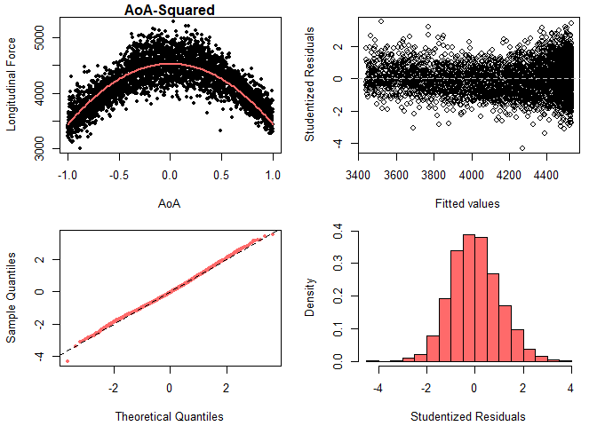

SLR Analysis for Modeling AoA (sweep-dataset)
================
Mohammad Hosseini (<mohammadhosseini@vt.edu>)

  - [Data Set](#data-set)
  - [AoA with a Polynomial Kernel](#aoa-with-a-polynomial-kernel)
  - [AoA, Quadratic Term Only](#aoa-quadratic-term-only)
  - [Comparing Models via ANOVA](#comparing-models-via-anova)

-----

## Data Set

``` r
load("longForce_AoA_100.rda")
data <- longForce_AoA_100

## Training and testing data sets
n <- nrow(data)
size <- floor(n*0.7)
train.ind <- sample(n, size, replace=FALSE)
train <- data[train.ind,]
test <- data[-train.ind,]
```

<br>

## AoA with a Polynomial Kernel

``` r
# Running linear regression
train$AoA2 <- train$AoA^2
lm.AoA2 <- lm(longitudinal.force ~ AoA + AoA2, data=train)

# Plotting the regression lines
plot(train$AoA, train$longitudinal.force, xlab="AoA", ylab="Longitudinal Force",
     col=1, pch=20, main="")
xgrid <- seq(-1,1,length=100)
ygrid <- lm.AoA2$coef[1] + lm.AoA2$coef[2]*xgrid + lm.AoA2$coef[3]*xgrid^2
lines(xgrid, ygrid, col="indianred1", lwd=2)

library(sjPlot, quietly = TRUE)
```

<!-- -->

``` r
summary(lm.AoA2)
```

    ## 
    ## Call:
    ## lm(formula = longitudinal.force ~ AoA + AoA2, data = train)
    ## 
    ## Residuals:
    ##     Min      1Q  Median      3Q     Max 
    ## -980.52 -146.02   -8.43  139.51  843.69 
    ## 
    ## Coefficients:
    ##              Estimate Std. Error t value Pr(>|t|)    
    ## (Intercept)  4531.095      5.627  805.19   <2e-16 ***
    ## AoA            70.270      6.529   10.76   <2e-16 ***
    ## AoA2        -1091.252     12.651  -86.26   <2e-16 ***
    ## ---
    ## Signif. codes:  0 '***' 0.001 '**' 0.01 '*' 0.05 '.' 0.1 ' ' 1
    ## 
    ## Residual standard error: 217.8 on 3357 degrees of freedom
    ## Multiple R-squared:  0.692,  Adjusted R-squared:  0.6918 
    ## F-statistic:  3771 on 2 and 3357 DF,  p-value: < 2.2e-16

<br>

### Checking LR Assumptions

``` r
par(mfrow = c(2, 2), mai=c(.7,.7,.2,.2))
plot(train$AoA, train$longitudinal.force, xlab="AoA", ylab="Longitudinal Force",
     col=1, pch=20, main="Polynomial Kernel")
xgrid <- seq(-1,1,length=100)
ygrid <- lm.AoA2$coef[1] + lm.AoA2$coef[2]*xgrid + lm.AoA2$coef[3]*xgrid^2
lines(xgrid, ygrid, col="indianred1", lwd=2)
## AoA
plot(lm.AoA2$fitted, rstudent(lm.AoA2),xlab="Fitted values", ylab="Studentized Residuals",
     col=1, main=""); abline(h=0, col=8, lty=2)
qqnorm(rstudent(lm.AoA2), pch=20, col="indianred1", main=""); abline(a=0, b=1, lty=2)
hist(rstudent(lm.AoA2),freq=FALSE, col="indianred1", xlab="Studentized Residuals", main="")
```

<!-- -->
<br>

## AoA, Quadratic Term Only

``` r
# Running linear regression
lm.AoA3 <- lm(longitudinal.force ~ AoA2, data=train)

# Plotting the regression lines
plot(train$AoA, train$longitudinal.force, xlab="AoA", ylab="Longitudinal Force",
     col=1, pch=20, main="")
xgrid <- seq(-1,1,length=100)
ygrid <- lm.AoA3$coef[1] + lm.AoA3$coef[2]*xgrid^2
lines(xgrid, ygrid, col="indianred1", lwd=2)
```

<!-- -->

``` r
summary(lm.AoA3)
```

    ## 
    ## Call:
    ## lm(formula = longitudinal.force ~ AoA2, data = train)
    ## 
    ## Residuals:
    ##     Min      1Q  Median      3Q     Max 
    ## -945.77 -154.46   -8.88  141.32  775.67 
    ## 
    ## Coefficients:
    ##              Estimate Std. Error t value Pr(>|t|)    
    ## (Intercept)  4530.432      5.722  791.70   <2e-16 ***
    ## AoA2        -1090.054     12.865  -84.73   <2e-16 ***
    ## ---
    ## Signif. codes:  0 '***' 0.001 '**' 0.01 '*' 0.05 '.' 0.1 ' ' 1
    ## 
    ## Residual standard error: 221.5 on 3358 degrees of freedom
    ## Multiple R-squared:  0.6813, Adjusted R-squared:  0.6812 
    ## F-statistic:  7180 on 1 and 3358 DF,  p-value: < 2.2e-16

<br>

### Checking LR Assumptions

``` r
par(mfrow = c(2, 2), mai=c(.7,.7,.2,.2))
plot(train$AoA, train$longitudinal.force, xlab="AoA", ylab="Longitudinal Force",
     col=1, pch=20, main="AoA-Squared")
xgrid <- seq(-1,1,length=100)
ygrid <- lm.AoA3$coef[1] + lm.AoA3$coef[2]*xgrid^2
lines(xgrid, ygrid, col="indianred1", lwd=2)
## AoA
plot(lm.AoA3$fitted, rstudent(lm.AoA3),xlab="Fitted values", ylab="Studentized Residuals",
     col=1, main=""); abline(h=0, col=8, lty=2)
qqnorm(rstudent(lm.AoA3), pch=20, col="indianred1", main=""); abline(a=0, b=1, lty=2)
hist(rstudent(lm.AoA3),freq=FALSE, col="indianred1", xlab="Studentized Residuals", main="")
```

<!-- -->

<br>

## Comparing Models via ANOVA

``` r
anova(lm.AoA2,lm.AoA3)
```

    ## Analysis of Variance Table
    ## 
    ## Model 1: longitudinal.force ~ AoA + AoA2
    ## Model 2: longitudinal.force ~ AoA2
    ##   Res.Df       RSS Df Sum of Sq      F    Pr(>F)    
    ## 1   3357 159198982                                  
    ## 2   3358 164692694 -1  -5493711 115.84 < 2.2e-16 ***
    ## ---
    ## Signif. codes:  0 '***' 0.001 '**' 0.01 '*' 0.05 '.' 0.1 ' ' 1

-----
