Regression Analysis, Modeling Creepage
================
Mohammad Hosseini (<mohammadhosseini@vt.edu>)

  - [1. Creepage with a Quadratic Polynomial
    Kernel](#creepage-with-a-quadratic-polynomial-kernel)
  - [2. Comparison across Models](#comparison-across-models)
  - [3. Transformations](#transformations)
  - [4. Conclusion](#conclusion)

-----

### 1\. Creepage with a Quadratic Polynomial Kernel

``` r
load("creepage_sweep_100.rda")
data <- creepage_sweep_100

## Training and testing data sets
n <- nrow(data)
size <- floor(n*0.7)
train.ind <- sample(n, size, replace=FALSE)
test.ind <- setdiff(n, train.ind)
train <- data[train.ind,]
test <- data[test.ind,]

# Run linear regression
train$creepage2 <- train$creepage^2
lm.creep2 <- lm(longitudinal.force ~ creepage + creepage2, data=train)
summary(lm.creep2)
```

    ## 
    ## Call:
    ## lm(formula = longitudinal.force ~ creepage + creepage2, data = train)
    ## 
    ## Residuals:
    ##      Min       1Q   Median       3Q      Max 
    ## -1270.21  -200.88    14.38   187.53  1151.61 
    ## 
    ## Coefficients:
    ##             Estimate Std. Error t value Pr(>|t|)    
    ## (Intercept)   313.80      11.92   26.32   <2e-16 ***
    ## creepage     6249.47      28.86  216.56   <2e-16 ***
    ## creepage2   -2091.52      14.33 -145.95   <2e-16 ***
    ## ---
    ## Signif. codes:  0 '***' 0.001 '**' 0.01 '*' 0.05 '.' 0.1 ' ' 1
    ## 
    ## Residual standard error: 275.4 on 4197 degrees of freedom
    ## Multiple R-squared:  0.9619, Adjusted R-squared:  0.9619 
    ## F-statistic: 5.301e+04 on 2 and 4197 DF,  p-value: < 2.2e-16

<br>

#### 1.1 Creepage with Polynomial Kernel, Assumptions Check

``` r
par(mfrow = c(2,2), mai=c(.7,.7,.2,.2))
plot(train$creepage, train$longitudinal.force, xlab="Creepage", ylab="Longitudinal Force",
     col=1, pch=20, main="")
xgrid <- seq(0,2,length=100)
ygrid <- lm.creep2$coef[1] + lm.creep2$coef[2]*xgrid + lm.creep2$coef[3]*xgrid^2
lines(xgrid, ygrid, col="seagreen3", lwd=2)

## Original data
long.trans <- (train$longitudinal.force)
creep.trans <- (train$creepage)
creep.trans2 <- creep.trans^2
lm.creep.tsfd <- lm(long.trans ~ creep.trans + creep.trans2)
plot(lm.creep.tsfd$fitted, rstudent(lm.creep.tsfd), xlab="Fitted Values", ylab="Studentized Residuals",
     col=1, main=""); abline(h=0, col=8, lty=2)
qqnorm(rstudent(lm.creep.tsfd), pch=20, col="seagreen3", main=""); abline(a=0, b=1, lty=2)
hist(rstudent(lm.creep.tsfd),freq=FALSE, col="seagreen3", xlab="Studentized Residuals", main="")
```

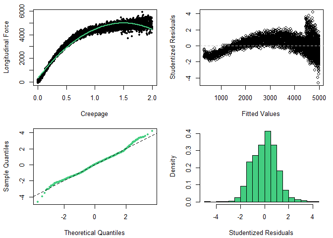<!-- -->

#### 1.3 Creepage with Square Root

``` r
# Run linear regression
train$creepage.sqr <- sqrt(train$creepage)
lm.creep.sqr <- lm(longitudinal.force ~ creepage + creepage.sqr, na.rm=TRUE, data=train)
summary(lm.creep.sqr)
```

    ## 
    ## Call:
    ## lm(formula = longitudinal.force ~ creepage + creepage.sqr, data = train, 
    ##     na.rm = TRUE)
    ## 
    ## Residuals:
    ##      Min       1Q   Median       3Q      Max 
    ## -1144.88  -190.27    -7.56   168.49  1645.82 
    ## 
    ## Coefficients:
    ##              Estimate Std. Error t value Pr(>|t|)    
    ## (Intercept)  -1694.65      22.35  -75.84   <2e-16 ***
    ## creepage     -2986.58      33.69  -88.64   <2e-16 ***
    ## creepage.sqr  8959.98      57.11  156.90   <2e-16 ***
    ## ---
    ## Signif. codes:  0 '***' 0.001 '**' 0.01 '*' 0.05 '.' 0.1 ' ' 1
    ## 
    ## Residual standard error: 259.1 on 4197 degrees of freedom
    ## Multiple R-squared:  0.9663, Adjusted R-squared:  0.9663 
    ## F-statistic: 6.018e+04 on 2 and 4197 DF,  p-value: < 2.2e-16

<br>

#### 1.4 Creepage with Squared Term, Assumptions Check

``` r
par(mfrow = c(2,2), mai=c(.7,.7,.2,.2))
plot(train$creepage, train$longitudinal.force, xlab="Creepage", ylab="Longitudinal Force",
     col=1, pch=20, main="")
lines(xgrid, ygrid, col="seagreen3", lwd=2)
plot(lm.creep.sqr$fitted, rstudent(lm.creep.sqr), xlab="Fitted Values", ylab="Studentized Residuals",
     col=1, main=""); abline(h=0, col=8, lty=2)
qqnorm(rstudent(lm.creep.sqr), pch=20, col="seagreen3", main=""); abline(a=0, b=1, lty=2)
hist(rstudent(lm.creep.sqr),freq=FALSE, col="seagreen3", xlab="Studentized Residuals", main="")
```

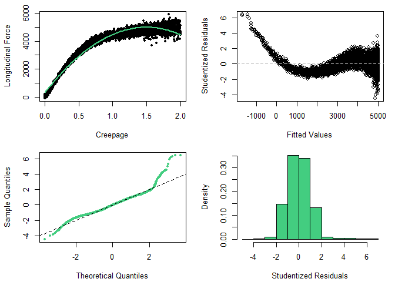<!-- -->

<br>

#### 1.5 Creepage with Squared and Square-root Terms

``` r
# Run linear regression
train$creepage.sqr <- sqrt(train$creepage)
lm.creep.sqr2 <- lm(longitudinal.force ~ creepage + creepage.sqr + creepage2, na.rm=TRUE, data=train)
summary(lm.creep.sqr2)
```

    ## 
    ## Call:
    ## lm(formula = longitudinal.force ~ creepage + creepage.sqr + creepage2, 
    ##     data = train, na.rm = TRUE)
    ## 
    ## Residuals:
    ##      Min       1Q   Median       3Q      Max 
    ## -1194.07  -151.11   -14.44   144.58  1070.84 
    ## 
    ## Coefficients:
    ##              Estimate Std. Error t value Pr(>|t|)    
    ## (Intercept)   -916.44      29.03 -31.571   <2e-16 ***
    ## creepage      1103.33     116.74   9.451   <2e-16 ***
    ## creepage.sqr  5193.66     115.36  45.020   <2e-16 ***
    ## creepage2     -985.90      27.23 -36.203   <2e-16 ***
    ## ---
    ## Signif. codes:  0 '***' 0.001 '**' 0.01 '*' 0.05 '.' 0.1 ' ' 1
    ## 
    ## Residual standard error: 226.2 on 4196 degrees of freedom
    ## Multiple R-squared:  0.9743, Adjusted R-squared:  0.9743 
    ## F-statistic: 5.308e+04 on 3 and 4196 DF,  p-value: < 2.2e-16

<br>

#### 1.6 Creepage with Squared and Square-root Terms, Assumptions Check

``` r
par(mfrow = c(2,2), mai=c(.7,.7,.2,.2))
plot(train$creepage, train$longitudinal.force, xlab="Creepage", ylab="Longitudinal Force",
     col=1, pch=20, main="")
lines(xgrid, ygrid, col="seagreen3", lwd=2)
plot(lm.creep.sqr2$fitted, rstudent(lm.creep.sqr2), xlab="Fitted Values", ylab="Studentized Residuals",
     col=1, main=""); abline(h=0, col=8, lty=2)
qqnorm(rstudent(lm.creep.sqr2), pch=20, col="seagreen3", main=""); abline(a=0, b=1, lty=2)
hist(rstudent(lm.creep.sqr2),freq=FALSE, col="seagreen3", xlab="Studentized Residuals", main="")
```

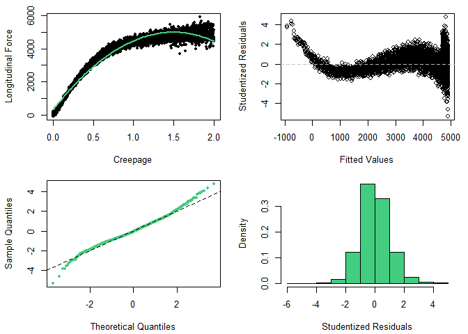<!-- -->

<br>

#### 1.7 Locally Linear Model

#### 1.7.1 Clustering

``` r
library(mclust, quietly = TRUE)
library(sjPlot, quietly = TRUE)
creepage.clusters <- Mclust(data=train[, c(5, 1)], G=2:5, modelNames = mclust.options("emModelNames"))
plot(creepage.clusters$BIC)
```

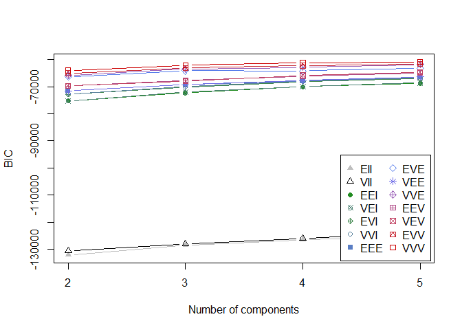<!-- -->

<br>

There is not much difference in BIC and the slopes of the lines is very
small, so we take the simplest case of two clusters.

``` r
## 2 clusters
creepage.2clusters <- Mclust(data=train[, c(5, 1)], G=2, modelNames = mclust.options("emModelNames"))
mclust2Dplot(data=train[, c(5, 1)], parameters=creepage.2clusters$parameters, z=creepage.2clusters$z,
             xlab="Creepage", ylab="Longitudinal Force", col=c("seagreen3", "royalblue2"))
abline(v=0.6, col=8, lty=2, lwd=2); text(0.35, 5000, "0.6% Creepage", col=2)
```

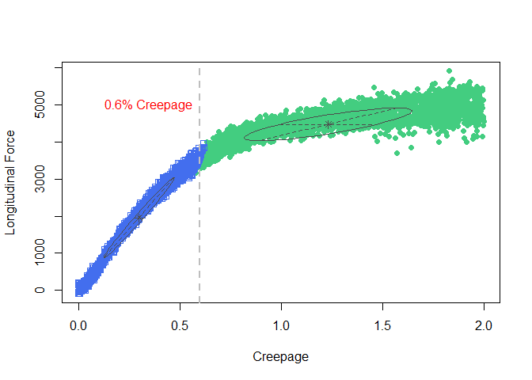<!-- -->

``` r
## Density plot
x <- seq(min(train$creepage), max(train$creepage), length=50) 
y <- seq(min(train$longitudinal.force), max(train$longitudinal.force), length=50) 
xy <- expand.grid(x,y)
xyD <- matrix(dens(modelName=creepage.2clusters$modelName, data=xy, 
                   parameters=creepage.2clusters$parameters), 
                   nrow=length(x), ncol=length(y))
persp(x, y, xyD, theta=-20, xlab="Creepage", ylab="Longitudinal Force", zlab="density")
```

<!-- -->

#### 1.7.2 Locally Linear Regression Model

``` r
## Add categories to train
train$creepage.clusters <- as.factor(ifelse(train$creepage < 0.6, "C1", "C2"))

# Run linear regression
lm.creep.clust <- lm(longitudinal.force ~ creepage*creepage.clusters, data=train)
summary(lm.creep.clust)
```

    ## 
    ## Call:
    ## lm(formula = longitudinal.force ~ creepage * creepage.clusters, 
    ##     data = train)
    ## 
    ## Residuals:
    ##      Min       1Q   Median       3Q      Max 
    ## -1069.83  -133.64     9.23   140.95   914.25 
    ## 
    ## Coefficients:
    ##                              Estimate Std. Error t value Pr(>|t|)    
    ## (Intercept)                    114.57      11.38   10.06   <2e-16 ***
    ## creepage                      6161.27      33.13  185.98   <2e-16 ***
    ## creepage.clustersC2           3299.65      17.55  188.00   <2e-16 ***
    ## creepage:creepage.clustersC2 -5303.81      34.68 -152.92   <2e-16 ***
    ## ---
    ## Signif. codes:  0 '***' 0.001 '**' 0.01 '*' 0.05 '.' 0.1 ' ' 1
    ## 
    ## Residual standard error: 220.3 on 4196 degrees of freedom
    ## Multiple R-squared:  0.9756, Adjusted R-squared:  0.9756 
    ## F-statistic: 5.604e+04 on 3 and 4196 DF,  p-value: < 2.2e-16

<br>

#### 1.7.3 Assumptions Check

``` r
par(mfrow = c(2,2), mai=c(.7,.7,.2,.2))
x1.grid <- with(subset(train, creepage.clusters=="C1"), seq(min(creepage), max(creepage), length=100))
x2.grid <- with(subset(train, creepage.clusters=="C2"), seq(min(creepage), max(creepage), length=100))
y1.grid <- with(subset(train, creepage.clusters=="C2"), 
                coef(lm.creep.clust)[1] + coef(lm.creep.clust)[2]*x1.grid)
y2.grid <- with(subset(train, creepage.clusters=="C2"), 
                (coef(lm.creep.clust)[1] + coef(lm.creep.clust)[3]) +
                (coef(lm.creep.clust)[2] + coef(lm.creep.clust)[4])*x2.grid)
plot(train$creepage, train$longitudinal.force, xlab="Creepage", ylab="Longitudinal Force",
     col=ifelse(train$creepage.clusters=="C1", "royalblue2", "seagreen3"), pch=20, main="")
lines(x1.grid, y1.grid, col="indianred2", lwd=2)
lines(x2.grid, y2.grid, col="indianred2", lwd=2)
plot(lm.creep.clust$fitted, rstudent(lm.creep.clust), xlab="Fitted Values", 
     ylab="tStudentized Residuals", col=1, main=""); abline(h=0, col=8, lty=2)
qqnorm(rstudent(lm.creep.clust), pch=20, col="seagreen3", main=""); abline(a=0, b=1, lty=2)
hist(rstudent(lm.creep.clust),freq=FALSE, col="seagreen3", xlab="Studentized Residuals", main="")
```

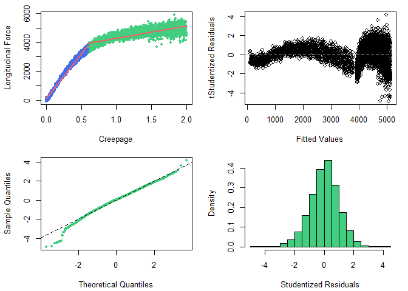<!-- -->

<br>

### 2\. Comparison across Models

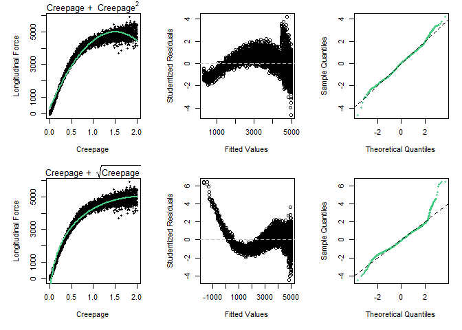<!-- -->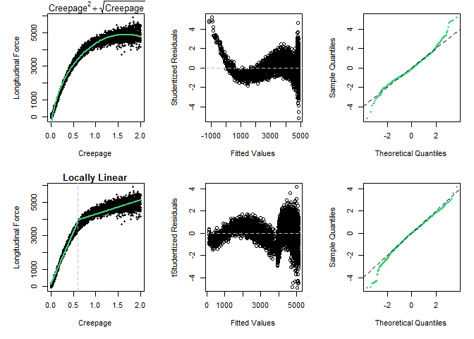<!-- -->

<br>

### 3\. Transformations

To fix the heteroscedasticity, we apply transformations to the
explanatory variables and the response. Log transformation is typically
used on such occasions and the results of applying it to our data set is
shown below.

<br>

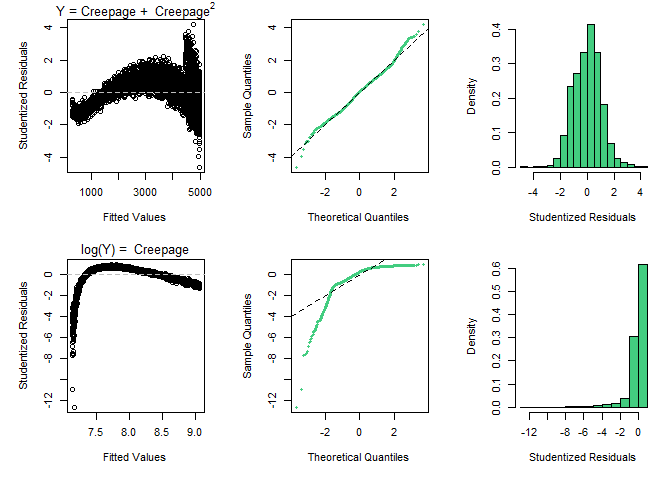<!-- -->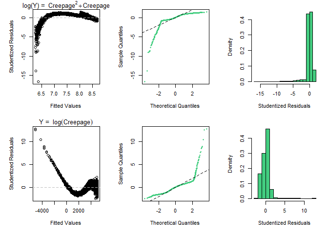<!-- -->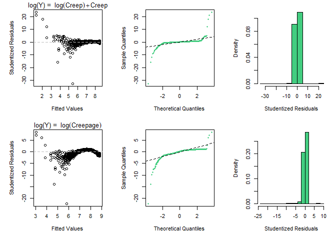<!-- -->

We observe that taking the logarithm of the response, in our case, the
longitudinal force, resolves the non-constant variance; however, it
heavily skews the distribution of the residuals and makes the non-linear
pattern stronger.

### 4\. Conclusion

Comparing the log-transformation and the quadratic polynomial, the
latter appears to be more plausible since the normality assumption is
met and the non-linearity in the residuals is not as strong as the
log-transformed model. Here we don’t have a strong model satisfying all
the assumptions of the linear regression as it was the case with the
longitudinal and the AoA but we can consider the polynomial (quadratic)
regression model as a decent proxy.

-----
