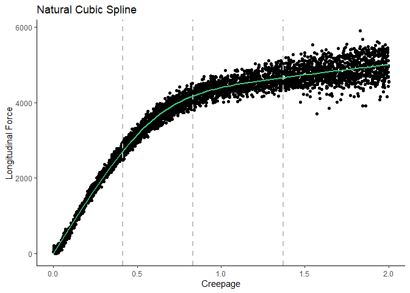
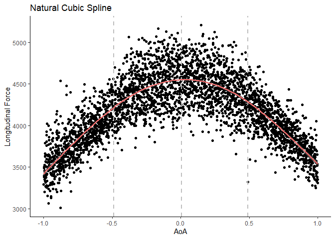
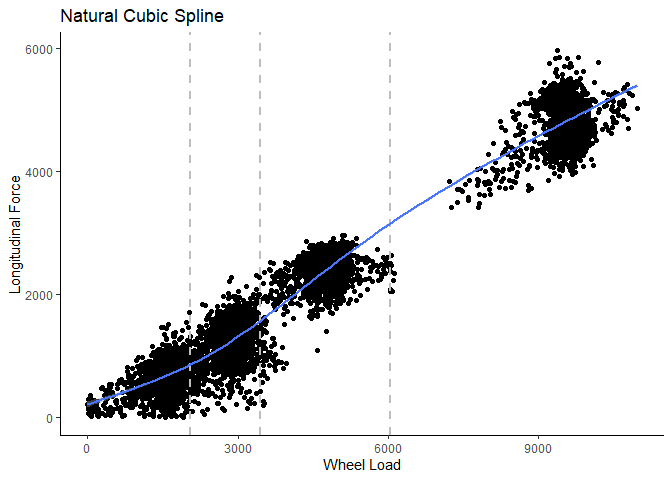
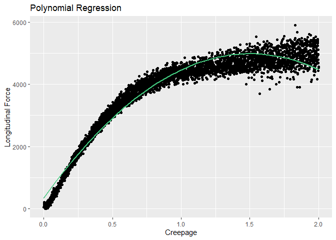
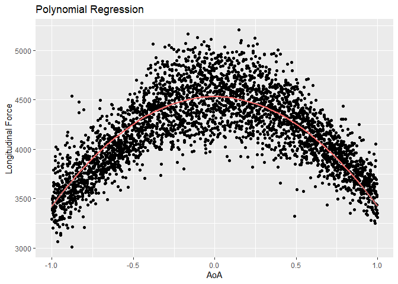
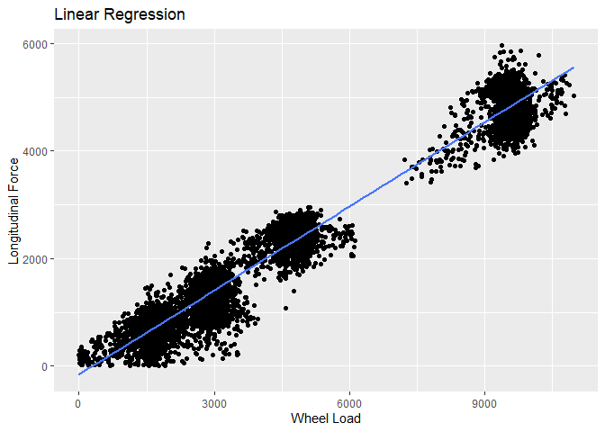

Spline Regression Models
================
Mohammad Hosseini (<mohammadhosseini@vt.edu>)

  - [1. Training & Testing Sets](#training-testing-sets)
  - [2. Spline Regression Models](#spline-regression-models)
  - [3. Polynomial Regression Models](#polynomial-regression-models)
  - [4. Comparison](#comparison)

-----

### 1\. Training & Testing Sets

``` r
## Load data
load("comboData100.rda")
load("creepage_sweep_100.rda")
load("longForce_AoA_100.rda")
load("longTests100.rda")

## Make sure the signs are right!
combo.data[,c(1,3)] <- abs(combo.data[,c(1,3)])
creepage_sweep_100[,c(1,3)] <- abs(creepage_sweep_100[,c(1,3)])
longForce_AoA_100[,c(1,3)] <- abs(longForce_AoA_100[,c(1,3)])
longTests100[,c(1,3)] <- abs(longTests100[,c(1,3)])

## Divide to training and testing sets
set.seed(98)
n <- nrow(combo.data)
size <- floor(n*0.7)
train.ind <- sample(n, size, replace=FALSE)
train <- combo.data[train.ind,]
test <- combo.data[-train.ind,]

## Creepage data set
set.seed(98)
n.creep <- nrow(creepage_sweep_100)
size.creep <- floor(n.creep*0.7)
train.ind.creep <- sample(n.creep, size.creep, replace=FALSE)
train.creep <- creepage_sweep_100[train.ind.creep,]
test.creep <- creepage_sweep_100[-train.ind.creep,]

## AoA data set
set.seed(98)
n.AoA <- nrow(longForce_AoA_100)
size.AoA <- floor(n.AoA*0.7)
train.ind.AoA <- sample(n.AoA, size.AoA, replace=FALSE)
train.AoA <- longForce_AoA_100[train.ind.AoA,]
test.AoA <- longForce_AoA_100[-train.ind.AoA,]

## Wheel load data set
set.seed(98)
n.vforce <- nrow(longTests100)
size.vforce <- floor(n.vforce*0.7)
train.ind.vforce <- sample(n.vforce, size.vforce, replace=FALSE)
train.vforce <- longTests100[train.ind.vforce,]
test.vforce <- longTests100[-train.ind.vforce,]
```

``` r
results <- data.frame(matrix(NA, nrow=8, ncol=5))
colnames(results) <- c("Model", "Parameter", "R2 (train)", "RMSE (test)", "R2 (test)")
results
```

    ##   Model Parameter R2 (train) RMSE (test) R2 (test)
    ## 1    NA        NA         NA          NA        NA
    ## 2    NA        NA         NA          NA        NA
    ## 3    NA        NA         NA          NA        NA
    ## 4    NA        NA         NA          NA        NA
    ## 5    NA        NA         NA          NA        NA
    ## 6    NA        NA         NA          NA        NA
    ## 7    NA        NA         NA          NA        NA
    ## 8    NA        NA         NA          NA        NA

<br>

## 2\. Spline Regression Models

### 2.1 Single Spline Regression Models

``` r
library(tidyverse, quietly = TRUE)
library(splines, quietly = TRUE)
library(MLmetrics, quietly = TRUE)
library(ggplot2, quietly = TRUE)

## Creepage
# Build the model
knots.creep <- quantile(train.creep$creepage, p = c(0.25, 0.5, 0.75))
model <- lm(longitudinal.force ~ ns(creepage, knots = knots.creep), data = train.creep)

# Make predictions
predictions <- model %>% predict(test.creep)

# Model performance
performance <- data.frame(
  R2.train = R2_Score(fitted(model), train.creep$longitudinal.force),
  RMSE = RMSE(predictions, test.creep$longitudinal.force),
  R2.test = R2_Score(predictions, test.creep$longitudinal.force)
)
results[1,] <- c("Spline", "Creepage", round(performance, digits = 2))
print(performance)
```

    ##    R2.train     RMSE   R2.test
    ## 1 0.9821786 190.7505 0.9821812

``` r
## Visualize
ggplot(train.creep, aes(creepage, longitudinal.force) ) +
  geom_point() +
  geom_vline(xintercept = knots.creep, linetype="dashed", color = 8, size = 1) +
  stat_smooth(method = lm, formula = y ~ splines::ns(x, df = 3), col="seagreen3") +
  ggtitle("Natural Cubic Spline") + 
  xlab("Creepage") + 
  ylab("Longitudinal Force") + 
  theme_classic()
```

<!-- -->

``` r
## AoA
# Build the model
knots.AoA <- quantile(train.AoA$AoA, p = c(0.25, 0.5, 0.75))
model <- lm(longitudinal.force ~ ns(AoA, knots = knots.AoA), data = train.AoA)

# Make predictions
predictions <- model %>% predict(test.AoA)

# Model performance
performance <- data.frame(
  R2.train = R2_Score(fitted(model), train.AoA$longitudinal.force),
  RMSE = RMSE(predictions, test.AoA$longitudinal.force),
  R2.test = R2_Score(predictions, test.AoA$longitudinal.force)
)
results[3,] <- c("Spline", "AoA", round(performance, digits = 2))
print(performance)
```

    ##   R2.train     RMSE   R2.test
    ## 1 0.700245 213.7712 0.7048775

``` r
## Visualize
ggplot(train.AoA, aes(AoA, longitudinal.force) ) +
  geom_point() +
  geom_vline(xintercept = knots.AoA, linetype="dashed", color = 8, size = 1) +
  stat_smooth(method = lm, formula = y ~ splines::ns(x, df = 3), col="indianred1") +
  ggtitle("Natural Cubic Spline") + 
  xlab("AoA") + 
  ylab("Longitudinal Force") + 
  theme_classic()
```

<!-- -->

``` r
## Wheel load
# Build the model
knots.vforce <- quantile(train.vforce$vertical.force, p = c(0.25, 0.5, 0.75))
model <- lm(longitudinal.force ~ ns(vertical.force, knots = knots.vforce), data = train.vforce)

# Make predictions
predictions <- model %>% predict(test.vforce)

# Model performance
performance <- data.frame(
  R2.train = R2_Score(fitted(model), train.vforce$longitudinal.force),
  RMSE = RMSE(predictions, test.vforce$longitudinal.force),
  R2.test = R2_Score(predictions, test.vforce$longitudinal.force)
)
results[5,] <- c("Spline", "Load", round(performance, digits = 2))
print(performance)
```

    ##    R2.train     RMSE   R2.test
    ## 1 0.9612021 328.5706 0.9588659

``` r
## Visualize
ggplot(train.vforce, aes(vertical.force, longitudinal.force) ) +
  geom_point() +
  geom_vline(xintercept = knots.vforce, linetype="dashed", color = 8, size = 1) +
  stat_smooth(method = lm, formula = y ~ splines::ns(x, df = 3), col="royalblue1") +
  ggtitle("Natural Cubic Spline") + 
  xlab("Wheel Load") + 
  ylab("Longitudinal Force") + 
  theme_classic()
```

<!-- -->
<br><br>

### 2.2 Mutliple Spline Regression Model

``` r
## Natural Cubic Spline
# Build the model
model.ns <- lm(longitudinal.force ~ ns(creepage, knots = knots.creep) +
               ns(AoA, knots = knots.AoA) + 
               ns(vertical.force, knots = knots.vforce), data = train)
summary(model.ns)
```

    ## 
    ## Call:
    ## lm(formula = longitudinal.force ~ ns(creepage, knots = knots.creep) + 
    ##     ns(AoA, knots = knots.AoA) + ns(vertical.force, knots = knots.vforce), 
    ##     data = train)
    ## 
    ## Residuals:
    ##      Min       1Q   Median       3Q      Max 
    ## -1555.95  -163.01    -5.33   167.01  1406.99 
    ## 
    ## Coefficients:
    ##                                           Estimate Std. Error t value Pr(>|t|)
    ## (Intercept)                               -5858.27      38.81 -150.94   <2e-16
    ## ns(creepage, knots = knots.creep)1         4380.20      20.40  214.73   <2e-16
    ## ns(creepage, knots = knots.creep)2         4001.38      19.46  205.61   <2e-16
    ## ns(creepage, knots = knots.creep)3         7536.97      42.70  176.49   <2e-16
    ## ns(creepage, knots = knots.creep)4         3001.18      10.21  294.02   <2e-16
    ## ns(AoA, knots = knots.AoA)1                1479.36      19.16   77.21   <2e-16
    ## ns(AoA, knots = knots.AoA)2                 421.80      23.25   18.14   <2e-16
    ## ns(AoA, knots = knots.AoA)3                 687.26      48.47   14.18   <2e-16
    ## ns(AoA, knots = knots.AoA)4                -333.41      22.16  -15.05   <2e-16
    ## ns(vertical.force, knots = knots.vforce)1  1426.98      26.02   54.84   <2e-16
    ## ns(vertical.force, knots = knots.vforce)2  4552.03      24.77  183.80   <2e-16
    ## ns(vertical.force, knots = knots.vforce)3  5412.83      58.80   92.05   <2e-16
    ## ns(vertical.force, knots = knots.vforce)4  4376.04      19.55  223.81   <2e-16
    ##                                              
    ## (Intercept)                               ***
    ## ns(creepage, knots = knots.creep)1        ***
    ## ns(creepage, knots = knots.creep)2        ***
    ## ns(creepage, knots = knots.creep)3        ***
    ## ns(creepage, knots = knots.creep)4        ***
    ## ns(AoA, knots = knots.AoA)1               ***
    ## ns(AoA, knots = knots.AoA)2               ***
    ## ns(AoA, knots = knots.AoA)3               ***
    ## ns(AoA, knots = knots.AoA)4               ***
    ## ns(vertical.force, knots = knots.vforce)1 ***
    ## ns(vertical.force, knots = knots.vforce)2 ***
    ## ns(vertical.force, knots = knots.vforce)3 ***
    ## ns(vertical.force, knots = knots.vforce)4 ***
    ## ---
    ## Signif. codes:  0 '***' 0.001 '**' 0.01 '*' 0.05 '.' 0.1 ' ' 1
    ## 
    ## Residual standard error: 276.9 on 14548 degrees of freedom
    ## Multiple R-squared:  0.9699, Adjusted R-squared:  0.9699 
    ## F-statistic: 3.909e+04 on 12 and 14548 DF,  p-value: < 2.2e-16

``` r
# Make predictions
predictions <- model.ns %>% predict(test)

# Model performance
performance <- data.frame(
  R2 = R2_Score(fitted(model.ns), train$longitudinal.force),
  RMSE = RMSE(predictions, test$longitudinal.force),
  R2.test = R2_Score(predictions, test$longitudinal.force)
)
results[7,] <- c("Spline", "All", round(performance, digits = 2))
print(performance)
```

    ##          R2     RMSE   R2.test
    ## 1 0.9699196 275.2188 0.9697558

<br>

## 3\. Polynomial Regression Models

### 3.1 Polynomial Regression, Single Models

``` r
## Creepage
# Build the model
model <- lm(longitudinal.force ~ poly(creepage, 2, raw = TRUE), data = train.creep)
# Make predictions
predictions <- model %>% predict(test.creep)
# Model performance
performance <- data.frame(
  R2.train = R2_Score(fitted(model), train.creep$longitudinal.force),
  RMSE = RMSE(predictions, test.creep$longitudinal.force),
  R2.test = R2_Score(predictions, test.creep$longitudinal.force)
)
results[2,] <- c("Regression", "Creepage", round(performance, digits = 2))
print(performance)
```

    ##    R2.train     RMSE   R2.test
    ## 1 0.9608516 270.3024 0.9642194

``` r
# Visualize 
ggplot(train.creep, aes(creepage, longitudinal.force) ) +
  geom_point() +
  stat_smooth(method = lm, formula = y ~ poly(x, 2, raw = TRUE), col="seagreen3") +
  ggtitle("Polynomial Regression") + 
  xlab("Creepage") + 
  ylab("Longitudinal Force")
```

<!-- -->

``` r
## Creepage
# Build the model
model <- lm(longitudinal.force ~ I(AoA^2), data = train.AoA)
# Make predictions
predictions <- model %>% predict(test.AoA)
# Model performance
performance <- data.frame(
  R2.train = R2_Score(fitted(model), train.AoA$longitudinal.force),
  RMSE = RMSE(predictions, test.AoA$longitudinal.force),
  R2.test = R2_Score(predictions, test.AoA$longitudinal.force)
)
results[4,] <- c("Regression", "AoA", round(performance, digits = 2))
print(performance)
```

    ##    R2.train     RMSE   R2.test
    ## 1 0.6867269 221.3416 0.6836047

``` r
# Visualize 
ggplot(train.AoA, aes(AoA, longitudinal.force) ) +
  geom_point() +
  stat_smooth(method = lm, formula = y ~ I(x^2), col="indianred1") +
  ggtitle("Polynomial Regression") + 
  xlab("AoA") + 
  ylab("Longitudinal Force")
```

<!-- -->

``` r
## Creepage
# Build the model
model <- lm(longitudinal.force ~ vertical.force, data = train.vforce)
# Make predictions
predictions <- model %>% predict(test.vforce)
# Model performance
performance <- data.frame(
  R2.train = R2_Score(fitted(model), train.vforce$longitudinal.force),
  RMSE = RMSE(predictions, test.vforce$longitudinal.force),
  R2.test = R2_Score(predictions, test.vforce$longitudinal.force)
)
results[6,] <- c("Regression", "Load", round(performance, digits = 2))
print(performance)
```

    ##    R2.train     RMSE   R2.test
    ## 1 0.9590286 338.5362 0.9563329

``` r
# Visualize 
ggplot(train.vforce, aes(vertical.force, longitudinal.force) ) +
  geom_point() +
  stat_smooth(method = lm, formula = y ~ x, col="royalblue1") +
  ggtitle("Linear Regression") + 
  xlab("Wheel Load") + 
  ylab("Longitudinal Force")
```

<!-- -->

<br>

### 3.2 Mutliple Polynomial Regression Model

``` r
## Natural Cubic Spline
# Build the model
model.ml <- lm(longitudinal.force ~ poly(creepage, 2, raw = TRUE) + I(AoA^2) + vertical.force, data = train)
summary(model.ml)
```

    ## 
    ## Call:
    ## lm(formula = longitudinal.force ~ poly(creepage, 2, raw = TRUE) + 
    ##     I(AoA^2) + vertical.force, data = train)
    ## 
    ## Residuals:
    ##      Min       1Q   Median       3Q      Max 
    ## -1541.55  -236.02   -20.22   214.03  2099.11 
    ## 
    ## Coefficients:
    ##                                  Estimate Std. Error t value Pr(>|t|)    
    ## (Intercept)                    -4.081e+03  1.702e+01 -239.79   <2e-16 ***
    ## poly(creepage, 2, raw = TRUE)1  6.169e+03  3.129e+01  197.19   <2e-16 ***
    ## poly(creepage, 2, raw = TRUE)2 -2.066e+03  1.297e+01 -159.31   <2e-16 ***
    ## I(AoA^2)                       -1.470e+03  1.689e+01  -87.04   <2e-16 ***
    ## vertical.force                  4.792e-01  1.084e-03  442.02   <2e-16 ***
    ## ---
    ## Signif. codes:  0 '***' 0.001 '**' 0.01 '*' 0.05 '.' 0.1 ' ' 1
    ## 
    ## Residual standard error: 355.7 on 14556 degrees of freedom
    ## Multiple R-squared:  0.9503, Adjusted R-squared:  0.9503 
    ## F-statistic: 6.963e+04 on 4 and 14556 DF,  p-value: < 2.2e-16

``` r
# Make predictions
predictions <- model.ml %>% predict(test)

# Model performance
performance <- data.frame(
  R2.train = R2_Score(fitted(model.ml), train$longitudinal.force),
  RMSE = RMSE(predictions, test$longitudinal.force),
  R2.test = R2_Score(predictions, test$longitudinal.force)
)
results[8,] <- c("Regression", "All", round(performance, digits = 2))
print(performance)
```

    ##    R2.train     RMSE   R2.test
    ## 1 0.9503311 354.6028 0.9497923

<br>

## 4\. Comparison

``` r
library(knitr)
save(results, file="splineRegResults.rdata")
results <- rbind(results, c("Boostrap on Reg.", "All", "", "150", ""))
kable(results, align = "l")
```

| Model            | Parameter | R2 (train) | RMSE (test) | R2 (test) |
| :--------------- | :-------- | :--------- | :---------- | :-------- |
| Spline           | Creepage  | 0.98       | 190.75      | 0.98      |
| Regression       | Creepage  | 0.96       | 270.3       | 0.96      |
| Spline           | AoA       | 0.7        | 213.77      | 0.7       |
| Regression       | AoA       | 0.69       | 221.34      | 0.68      |
| Spline           | Load      | 0.96       | 328.57      | 0.96      |
| Regression       | Load      | 0.96       | 338.54      | 0.96      |
| Spline           | All       | 0.97       | 275.22      | 0.97      |
| Regression       | All       | 0.95       | 354.6       | 0.95      |
| Boostrap on Reg. | All       |            | 150         |           |

-----
